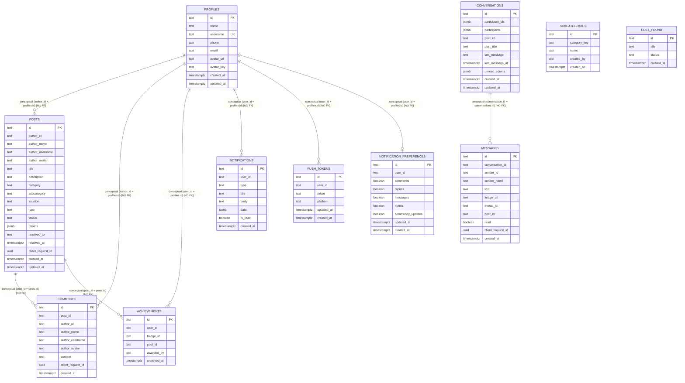

# Retrv — Data Model & Schema Architecture

> **Source of Truth:** Live PostgreSQL schema defined in [supabase-schema.sql](../../supabase-schema.sql).  
> **Schema Reality:** All 11 tables currently lack foreign key constraints (`REFERENCES`). Relational integrity is enforced conceptually by client-side application logic.

---

## 1. Entity-Relationship Diagram

---

## 2. Table-by-Table Architectural Specification

| Table | Primary Key | Actual DB Constraints | Conceptual Relationships | Ownership / Sensitivity | Classification |
|---|---|---|---|---|---|
| `profiles` | `id` (TEXT) | `username UNIQUE` | Links to `auth.users(id)` | Owner: `id` | **Mixed** (name/username public; phone/email private) |
| `posts` | `id` (TEXT) | `type IN ('lost', 'found')`, `status IN ('open', 'resolved', 'claimed')` | `author_id` -> `profiles(id)` | Owner: `author_id` | **Public** (community feed items) |
| `comments` | `id` (TEXT) | None | `post_id` -> `posts(id)`, `author_id` -> `profiles(id)` | Owner: `author_id` | **Public** (community discussion) |
| `conversations` | `id` (TEXT) | None | `participant_ids` contains 2 user UIDs | Shared: participants | **Strictly Private** |
| `messages` | `id` (TEXT) | None | `conversation_id` -> `conversations(id)`, `sender_id` -> `profiles(id)` | Owner: `sender_id` | **Strictly Private** |
| `notifications` | `id` (TEXT) | None | `user_id` -> `profiles(id)` | Owner: `user_id` | **Strictly Private** |
| `push_tokens` | `id` (TEXT) | None | `user_id` -> `profiles(id)` | Owner: `user_id` | **Strictly Private** |
| `notification_preferences`| `id` (TEXT) | None | `user_id` -> `profiles(id)` | Owner: `user_id` | **Private** |
| `achievements` | `id` (TEXT) | Partial index on `(post_id, badge_id)` | `user_id` -> `profiles(id)`, `post_id` -> `posts(id)` | Owner: `user_id` | **Public** (profile display badges) |
| `subcategories` | `id` (TEXT) | None | `created_by` -> `profiles(id)` | Community created | **Public** |
| `lost_found` | `id` (TEXT) | None | Legacy activity tracking | System legacy | **Legacy** |

---

## 3. Structural Deficits & Critical Notes

1. **Foreign Key Deficit:** No table in the current schema contains `REFERENCES`. When records are deleted (e.g., a post), associated records (`comments`, `achievements`) are not cascaded by the database.
2. **Post Status Constraint Inconsistency:** The database CHECK constraint allows `('open', 'resolved', 'claimed')`, but frontend logic attempts to assign `'returned'` for found items, risking database insert/update rejections.
3. **Comment Threading Gap:** The TypeScript model defines `parent_comment_id` and `root_comment_id`, but neither column exists in the PostgreSQL `comments` table.
