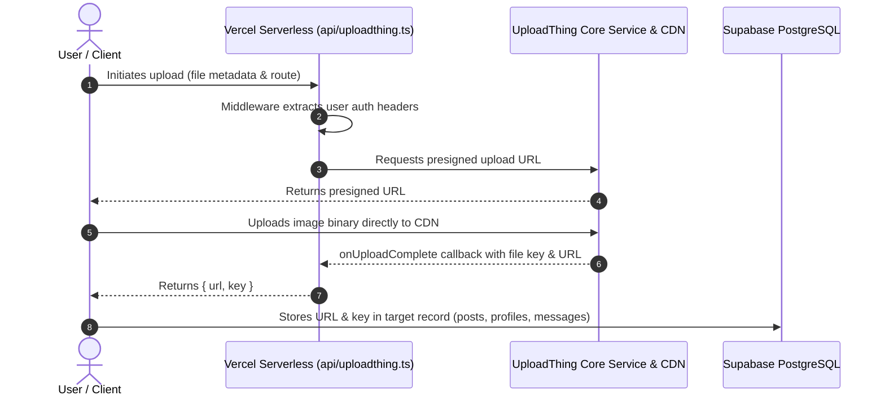

# Retrv — Media Upload Architecture (UploadThing)

> **Purpose:** Technical documentation of image upload pipelines, file key storage, CDN distribution, and authorization requirements in Retrv.

---

## 1. UploadThing Integration Architecture

Retrv utilizes [UploadThing](https://uploadthing.com) as its media backend, integrated via Vercel serverless functions in `api/uploadthing.ts` and client composables in `src/composables/useImageUpload.ts`.

---

## 2. Configured Upload Routes

| Route Identifier | Max File Size | Permitted Types | Target Subsystem | Destination Field |
|---|---|---|---|---|
| `avatarUploader` | 4 MB | `image/*` (max 1) | User Profile | `profiles.avatar_url`, `profiles.avatar_key` |
| `postImageUploader` | 8 MB | `image/*` (max 4) | Lost/Found Posts | `posts.photos` (JSONB array of URLs) |
| `messageImageUploader`| 8 MB server / 5 MB client | `image/*` (max 1) | Chat Messaging | `messages.image_url` |

---

## 3. Current Weaknesses & Future Hardening

### 1. Weak Middleware Authentication (Current Risk)
- **Current Behavior:** The middleware in `api/uploadthing.ts` reads arbitrary client headers (`x-user-id`, `authorization`) without cryptographically validating the Supabase JWT against Supabase Auth public keys or service role APIs.
- **Risk:** An unauthenticated user can forge headers and upload media files attributed to any arbitrary user ID.
- **Planned Hardening:** Validate the JWT with `@supabase/supabase-js` inside the upload middleware before granting an upload token.

### 2. Unauthenticated File Deletion Endpoint (Current Risk)
- **Current Behavior:** The `/api/uploadthing/delete` endpoint accepts a `fileKey` parameter and calls `utapi.deleteFiles(fileKey)` with zero authentication checks.
- **Risk:** Anyone who learns or guesses a file key can delete media belonging to other users.
- **Planned Hardening:** Require authentication and verify that the calling user is the author of the post, profile, or message that references the `fileKey`.
