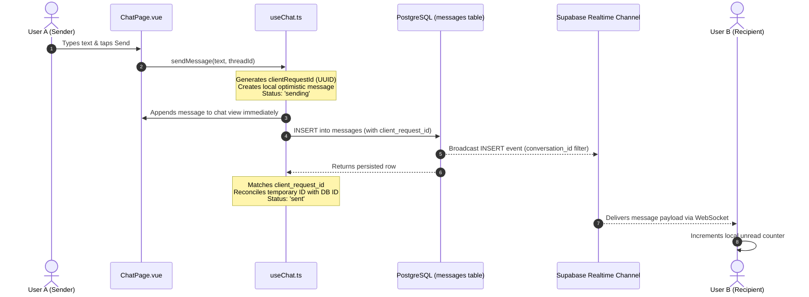

# Retrv — Realtime Messaging & Chat Architecture

> **Purpose:** Detailed architectural specification of 1-on-1 private messaging, conversation models, optimistic state synchronization, unread counters, and WebSocket lifecycle in Retrv.

---

## 1. Conversation & Message Data Model

### Conversation Identification
Conversations use a **deterministic composite ID format**:
```typescript
// src/services/chatService.ts
function getConversationId(userId1: string, userId2: string): string {
  const [first, second] = [userId1, userId2].sort();
  return `conv_${first}__${second}`;
}
```
- **Consequence:** Exactly **one** conversation record exists between any two users across the entire application, regardless of how many different Lost & Found posts they discuss.

### Threading Within Conversations (`thread_id`)
To separate multiple post contexts within a single 2-user conversation:
- General direct messages use `thread_id: 'general'`.
- Post-specific discussions set `thread_id: 'post_{postId}'` and store `post_id`.
- The UI filters messages by `thread_id` depending on whether the user entered chat from a specific post card or from the general inbox.

---

## 2. Message Lifecycle & Optimistic Updates



---

## 3. Realtime Subscription Lifecycle

### Scoped Message Subscription
- **Channel Name:** `conversation:{conversationId}`
- **Filter:** `conversation_id=eq.{conversationId}`
- **Event:** `INSERT`
- **Hook:** Mounted when `ChatPage.vue` enters; removed via `supabase.removeChannel()` on `onUnmounted`.

### Global Conversations Channel (Architectural Issue)
- **Channel Name:** `user-conversations-realtime` in `src/composables/useMessageUnread.ts`.
- **Known Issue:** Subscribes to **all** `conversations` table changes without a user-scoped database filter. Vue code performs client-side filtering (`conv.participant_ids.includes(myUid)`).
- **Target Invariant:** Realtime streaming must be scoped at the database/RLS layer so clients never receive conversation notifications for other users.

---

## 4. Unread Counting Architecture

Unread counts operate via a **hybrid model**:
1. **Database:** `conversations.unread_counts` (JSONB) stores `{ [userId: string]: number }`.
2. **Local Storage:** `laf_read_{conversationId}` caches the timestamp of the last viewed message.
3. **Reactive In-Memory Ref:** `globalConversations` maintains the live badge count across the app navigation bar.

### Resetting Unread Count Flow
When a user opens a conversation:
1. `useMessageUnread.setConversationRead(conversationId)` is invoked.
2. In-memory unread count is immediately zeroed.
3. Local storage timestamp is updated: `localStorage.setItem('laf_read_' + id, Date.now())`.
4. A database update resets `unread_counts->>myUid` to `0` and sets `messages.read = true WHERE conversation_id = :id AND sender_id != :myUid`.

> [!WARNING]
> The database update on `unread_counts` is currently a read-modify-write without row locks. Concurrent messages received while opening the chat may result in count drift.
