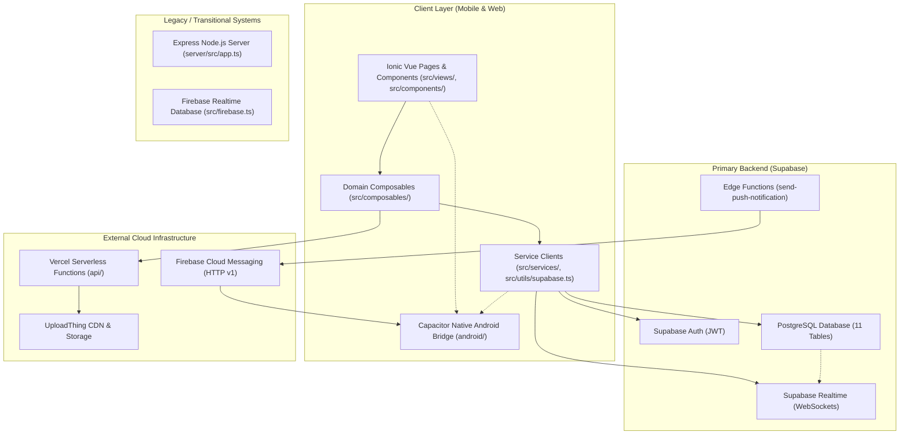

# Retrv — System Architecture Overview

> **Current Architecture Status:** Verified against active repository code (v2.5.0).  
> **Document Purpose:** Authoritative description of how Retrv is currently constructed across client, server, database, and cloud services.

---

## 1. High-Level Architecture Diagram

---

## 2. Frontend Layer (`src/`)

Retrv's client is an **Ionic Vue Single-Page Application (SPA)** packaged as a progressive web app and wrapped in an Android native shell via Capacitor.

### Sub-Layers
1. **Views & Pages (`src/views/` — 19 components):** Top-level route views mounted by Ionic's `ion-router-outlet`. Handle page transitions, tab switches, and route parameter extraction.
2. **Reusable UI Components (`src/components/` — 30 components):** Modals, cards, post composers, filters, and discussion threads.
3. **Domain Composables (`src/composables/` — 15 composables):** Serve as both reactive state stores (using module-level `ref()`) and data access layers. No centralized store library (e.g., Pinia) is used; state is shared via singleton composable exports.
4. **Services & Infrastructure (`src/services/`, `src/utils/`):** Encapsulate low-level API communication (`supabase.ts`, `chatService.ts`, `pushNotificationService.ts`, `apiConfig.ts`).

---

## 3. Backend & Cloud Infrastructure

### Primary Services
- **Supabase PostgreSQL:** Stores all relational data across 11 tables. Evaluates Row Level Security (RLS) on each operation.
- **Supabase Auth:** Manages email/password sign-in, token refresh, and user sessions. Provides the trusted `auth.uid()` security context.
- **Supabase Realtime:** Streams database row changes over WebSockets for live chat, comments, post updates, and notifications.
- **Supabase Edge Functions (`supabase/functions/`):** Deno runtime executing `send-push-notification`, communicating directly with FCM HTTP v1 using service account credentials.
- **UploadThing (`api/uploadthing.ts`):** Managed image storage pipeline for user avatars, lost/found item photos, and chat attachments.
- **Vercel Serverless (`api/`):** Hosts Next-generation API routes for username resolution and file upload middleware.

---

## 4. Current Architectural Limitations & Reality

While the application is functional end-to-end, the current system exhibits several structural realities that future work must address:

1. **Composable-Centric Layer Mixing:** Composables combine UI state management, caching, business logic, and direct database queries into single files without an intermediary repository layer.
2. **Client-Side Authorization Reliance:** Several sensitive mutations (in-app notification creation, merit badge insertion, post resolution) originate directly from browser queries rather than trusted server functions.
3. **Database Relational Integrity Deficit:** Foreign keys (`REFERENCES`) are not formally defined in the database schema; relationships are maintained solely by application convention.
4. **Permissive Row Level Security:** All active RLS policies in `supabase-schema.sql` utilize open `USING (true)` conditions, creating a critical data exposure risk.
5. **Dual Backend Coexistence:** An Express server (`server/src/app.ts`) and Firebase RTDB setup coexist with the primary Supabase architecture.
