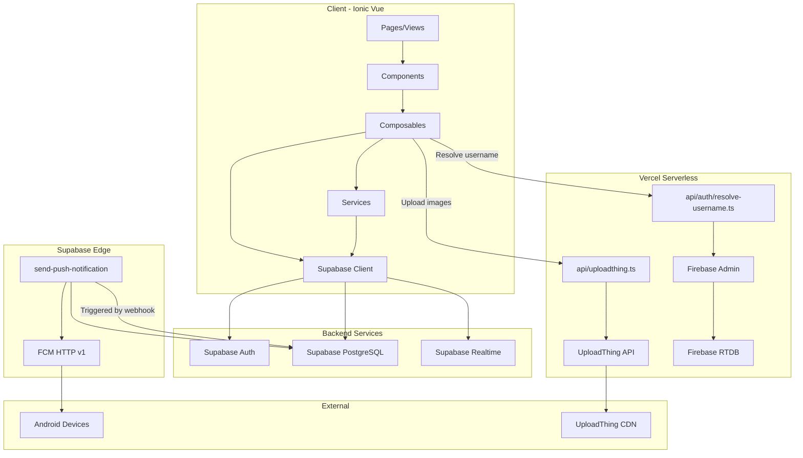
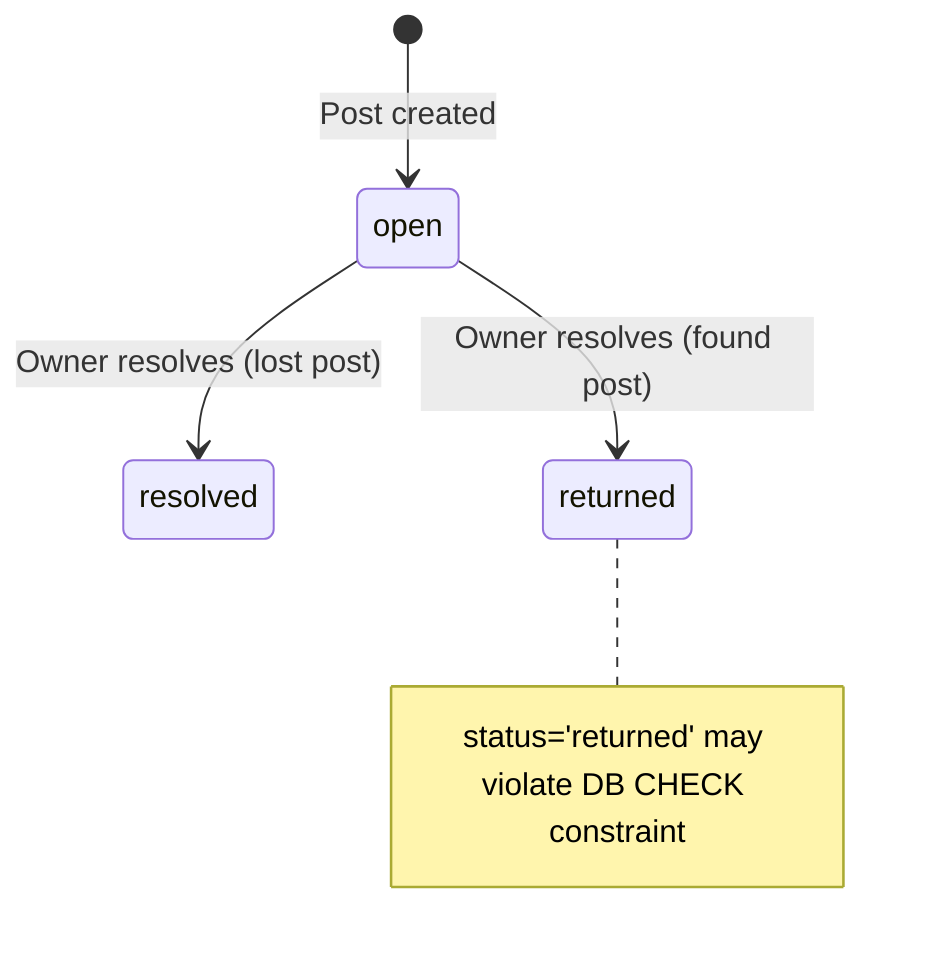
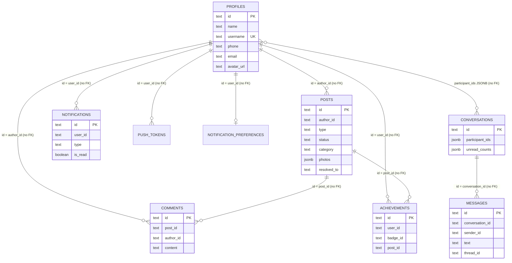

# Retrv — Full Architecture & System Audit

**Audit Date:** 2026-10-03  
**Auditor Type:** Automated Architecture / Security / QA Review  
**Scope:** Read-only, full repository  
**Repository:** `retrv-app` (v2.5.0)  

---

## 1. Executive Summary

### What the System Is

Retrv is a community-powered Lost & Found mobile application built with Ionic Vue (Vue 3) + TypeScript, backed by Supabase (PostgreSQL) for data, authentication, and realtime, with UploadThing for image uploads, Firebase/FCM for push notifications, and Capacitor for native Android deployment. The application is deployed to Vercel as a serverless web app and builds a native Android APK via GitHub Actions.

### Actual Architecture

The architecture is a **composable-centric SPA** where Vue pages call composables that directly interface with the Supabase client. There is no formal service/repository layer separation — composables serve as both business logic and data-access layers. A legacy Express server and Firebase Realtime Database exist but are largely superseded by Supabase. One Supabase Edge Function handles push notification delivery.

### Major Strengths

- Functional end-to-end Lost & Found workflow from post creation through resolution and merit awarding
- Idempotent insert mechanism for posts, comments, and messages preventing duplicate records
- Comprehensive notification preference system with per-category control
- Supabase Realtime used for live chat, comments, posts, and notifications
- Push notification pipeline with Edge Function, FCM v1 + legacy fallback, and dead token cleanup
- Client-side optimistic messaging with reconciliation
- Category/subcategory system with dynamic custom subcategory support

### Major Architectural Risks

1. **CRITICAL: All RLS policies are permissive `USING (true)`** — any authenticated (or potentially anonymous) user can read/write all rows in all tables
2. **Supabase anon key hardcoded as fallback in source code** (`supabase.ts`)
3. **No foreign keys defined anywhere** in the database schema
4. **Notification creation happens client-side** — any user can insert notifications for any other user
5. **Resolution and merit awarding are non-atomic** — post update and achievement insert are separate operations
6. **Server/Firebase RTDB code is legacy but still deployed** — two parallel data systems exist
7. **Near-zero test coverage** of business-critical workflows

### Highest-Priority Concerns

1. RLS permissiveness (P0 — data exposure)
2. Hardcoded Supabase key in source (P0 — credential exposure)
3. Client-side notification/achievement creation without server enforcement (P1)
4. No foreign key integrity (P1)
5. Non-atomic resolution workflow (P1)

---

## 2. Repository Overview

### Technology Stack (Confirmed)

| Technology | Confirmed | Evidence |
|---|---|---|
| Vue 3 | ✅ | `package.json` → `vue: ^3.5.0` |
| Ionic Vue | ✅ | `@ionic/vue: ^9.0.0` |
| TypeScript | ✅ | `typescript: ~5.9.0` |
| Vite | ✅ | `vite: 8.3.0`, `vite.config.ts` |
| Capacitor | ✅ | `@capacitor/core: ^8.5.2`, `capacitor.config.ts` |
| Supabase | ✅ | `@supabase/supabase-js: ^2.116.0`, `src/utils/supabase.ts` |
| UploadThing | ✅ | `uploadthing: ^7.7.4`, `api/uploadthing.ts` |
| Firebase | ✅ | `firebase: ^12.19.0`, `src/firebase.ts` |
| Firebase Admin | ✅ | `firebase-admin: ^13.1.0`, `server/src/firebaseAdmin.ts` |
| Express | ✅ (Legacy) | `express: ^4.21.2`, `server/src/app.ts` |
| Vitest | ✅ | `vitest: ^4.0.0`, 3 unit test files |
| Cypress | ✅ | `cypress: ^13.5.0`, `cypress.config.ts` |
| Pinia | ❌ Not used | No Pinia dependency or import found |

### Directory Map

| Path | Responsibility | Layer | Important Dependencies | Notes |
|---|---|---|---|---|
| `src/views/` | 19 page components | Presentation | Composables, Ionic | Main UI layer |
| `src/components/` | 30 reusable components | Presentation | Composables, Ionic | Shared UI widgets |
| `src/composables/` | 15 composables | Business Logic + Data Access | Supabase client, types | Core app logic |
| `src/services/` | 3 service files | Data Access + Infrastructure | Supabase, Capacitor Push | Chat, push, dev storage |
| `src/types/` | 8 type files | Types/Interfaces | None | Domain models |
| `src/config/` | 1 file (categories) | Configuration | None | Static category definitions |
| `src/data/` | 1 file (policies) | Static Data | None | Legal policy content |
| `src/utils/` | 5 utility files | Infrastructure | Supabase | Supabase client, API config, idempotency |
| `src/utilities/` | Empty | — | — | Unused directory |
| `src/router/` | 1 file | Navigation | Vue Router, useAuth | Route definitions + guards |
| `src/theme/` | CSS variables | Styling | Ionic CSS | Theme customization |
| `api/` | Vercel serverless functions | Server/API | UploadThing, Firebase Admin | Production API endpoints |
| `server/` | Express app (legacy) | Server | Firebase Admin, Express | Parallel server for dev/legacy |
| `supabase/` | Edge Functions + migrations | Backend | Supabase, FCM | Push notification Edge Function |
| `tests/` | Unit + E2E test scaffolding | Testing | Vitest, Cypress | Minimal coverage |
| `android/` | Capacitor Android project | Native | Gradle, Capacitor | Android build configuration |
| `policies/` | Legal documents | Documentation | None | Privacy, Terms, Guidelines |

---

## 3. Architecture Overview

### Actual Architectural Layers

```
Pages (src/views/)
    ↓
Components (src/components/)
    ↓
Composables (src/composables/) ← Business logic + data access combined
    ↓
Services (src/services/) ← Chat service, push service
    ↓
Supabase Client (src/utils/supabase.ts) ← Single shared browser client
    ↓
Supabase PostgreSQL (hosted)
    ↓
Supabase Edge Functions (supabase/functions/) ← Push notification delivery
    ↓
Firebase / FCM (push delivery)
```

### Architectural Leakage

| Issue | Evidence | Severity |
|---|---|---|
| Auth logic mixed into composable with 756 LOC | `useAuth.ts` contains sign-in, sign-up, profile CRUD, username resolution, dev bypass, session management | Medium |
| Notification creation done from client composable | `useNotifications.ts` line 106: client inserts directly into `notifications` table | High |
| Achievement/merit insert done from client | `useAchievements.ts` line 365: direct Supabase insert from browser | High |
| Post resolution is a simple `.update()` call from composable | `usePosts.ts` line 304-311, `useAchievements.ts` line 381 | High |
| Realtime subscription in App.vue root component | `App.vue` subscribes to conversations, notifications, and unread on mount | Medium |
| No formal service abstraction for posts, profiles, notifications | Composables directly call `supabase.from(...)` | Medium |

### System Context Diagram



---

## 4. Application Bootstrap

### Startup Sequence (Traced)

```
index.html
    ↓
src/main.ts
    ├── import App.vue
    ├── useTheme().initTheme()  ← Immediate, before Vue mount, prevents dark mode flash
    ├── createApp(App)
    │     .use(IonicVue)
    │     .use(router)
    ├── router.isReady()
    └── app.mount('#app')
            ↓
        App.vue onMounted()
            ├── document.addEventListener('visibilitychange', handleResume)
            ├── await initializeAuthSession()  ← Supabase auth state listener + getSession()
            ├── if (hasValidSession):
            │     ├── subscribeToConversations()
            │     ├── setupConversationsRealtime()
            │     ├── subscribeToNotifications()
            │     └── initPushNotifications(uid, router)
            └── watch(hasValidSession) → same subscriptions on auth change
```

### Globals Initialized at Startup

| What | Where | Timing |
|---|---|---|
| Theme | `main.ts` line 39 | Before Vue mount |
| Supabase auth listener | `useAuth.ts` `initializeAuthSession()` | App.vue `onMounted` |
| Conversation list | `useConversations.subscribeToConversations()` | After auth ready |
| Conversation realtime channel | `useMessageUnread.setupConversationsRealtime()` | After auth ready |
| Notification list + realtime | `useNotifications.subscribeToNotifications()` | After auth ready |
| Push notification listeners | `pushNotificationService.initPushNotifications()` | After auth ready |

### Potential Race Conditions

1. **`initializeAuthSession` called from both `App.vue onMounted` AND the router `beforeEach` guard** — the guard calls `await initializeAuthSession()` on every navigation. The function uses `authInitPromise` singleton to deduplicate, but the `onAuthStateChange` callback and `getSession()` can resolve independently.
2. **Push notification initialization depends on `currentAppUserId.value`** being set, which requires profile fetch to complete. If profile fetch is slow, push token registration may not occur.

---

## 5. Route & Navigation Architecture

### Route Inventory

| Route | Page/View | Auth Required | Parameters | Purpose |
|---|---|---|---|---|
| `/` | `LandingPage` | No | — | Public landing |
| `/auth` | `AuthPage` | No | — | Login/signup |
| `/onboarding` | `AuthPage` | No | — | Same as auth (reuse) |
| `/tabs` | `TabsPage` | Yes | — | Tab container |
| `/tabs/home` | `HomePage` | Yes | — | Main feed |
| `/tabs/messages` | `MessagesPage` | Yes | — | Conversation list |
| `/tabs/profile` | `ProfilePage` | Yes | — | Own profile |
| `/chat/:conversationId` | `ChatPage` | Yes | conversationId | Chat view |
| `/post/:id` | `PostDetailsPage` | Yes | id | Post details |
| `/profile/:userId` | `PublicProfilePage` | Yes | userId | Other user's profile |
| `/edit-profile` | `EditProfilePage` | Yes | — | Edit own profile |
| `/edit-post/:id` | `EditPostPage` | Yes | id | Edit own post |
| `/settings` | `SettingsPage` | Yes | — | App settings |
| `/settings/notifications` | `NotificationSettingsPage` | Yes | — | Notification preferences |
| `/settings/security` | `SecuritySettingsPage` | Yes | — | Security settings |
| `/settings/help` | `HelpCenterPage` | Yes | — | Help center |
| `/legal/privacy` | `PolicyPage` | No | policySlug=privacy | Privacy policy |
| `/legal/terms` | `PolicyPage` | No | policySlug=terms | Terms of use |
| `/legal/community-guidelines` | `PolicyPage` | No | policySlug=community-guidelines | Guidelines |
| `/legal/delete-account` | `PolicyPage` | No | policySlug=delete-account | Delete account info |
| `/messages` | redirect → `/tabs/messages` | — | — | Redirect |
| `/items`, `/home`, `/activity` | redirects | — | — | Legacy redirects |

### Navigation Guard Logic

The `router.beforeEach` guard implements four states:

1. **No user** → allow public routes, redirect others to `/auth`
2. **Anonymous user** → same as no user
3. **Non-anonymous but no profile** → same (redirect to `/auth`)
4. **Authenticated with profile** → redirect `/auth` and `/onboarding` to `/tabs/home`, allow everything else

### Guard Issues

- **`/tabs` routes are not individually protected** — the guard only checks `isPublicRoute` list. A route like `/post/:id` would redirect unauthenticated users to `/auth`, which is correct. However, the guard calls `await initializeAuthSession()` on **every single navigation**, which could cause latency on navigation transitions.
- **No 404/fallback route** defined — navigating to an undefined path will show a blank page.
- **`/onboarding` renders `AuthPage.vue`** — same component as `/auth`, the route name `Onboarding` exists but loads the same view.

---

## 6. Authentication

### Auth Flow (Traced)

```
User enters email/username + password
    ↓
useAuth.signIn()
    ├── Detect if email or username
    ├── If username: resolveUsername() → server API or Supabase profiles query → email
    ├── supabase.auth.signInWithPassword({ email, password })
    ├── clearDevSession()
    ├── mapSupabaseUser(data.user) → set currentUser ref
    ├── fetchProfile(uid) → Supabase profiles table → set currentProfile ref
    └── return User
```

### Auth State Storage

| Location | What | Evidence |
|---|---|---|
| `currentUser` (Vue ref) | Supabase User mapped | `useAuth.ts` line 80 |
| `currentProfile` (Vue ref) | Profile record | `useAuth.ts` line 81 |
| `sessionUser` (computed) | Merged user+profile | `useAuth.ts` line 402 |
| `currentAppUserId` (computed) | Canonical user ID | `useAuth.ts` line 421 |
| Supabase session | Access/refresh tokens | Managed by `@supabase/supabase-js` |
| localStorage (`dev_auth_session`) | Dev bypass session | `useAuth.ts` line 30 |

### Dev Bypass Authentication

The application has a development authentication bypass controlled by `VITE_DEV_BYPASS_AUTH=true`. When active:
- Users can "sign in" without Supabase Auth
- A synthetic `DevSession` is created with a `dev_` prefix UID
- Profile is upserted directly to `profiles` table
- Dev sessions are stored in localStorage

**Security concern:** The dev bypass flag is a `VITE_` prefixed variable, meaning it's compiled into the client bundle. If accidentally set in production, it would allow unauthenticated access.

### Issues

- **Multiple auth state sources**: `currentUser`, `currentProfile`, `sessionUser`, `currentAppUserId`, `sessionUid` — all computed from the same base refs but creating many aliases
- `isRealFirebaseUser` is an alias of `isRealSupabaseUser` (line 427) — legacy naming confusion
- Profile fetch failure during auth initialization is caught and logged but auth proceeds without profile, potentially causing downstream issues

---

## 7. Profiles

### Profile Schema (Database)

| Column | Type | Nullable | Purpose |
|---|---|---|---|
| `id` | TEXT PK | No | User ID (matches Supabase auth.users.id or dev_ prefix) |
| `name` | TEXT | No | Display name |
| `username` | TEXT UNIQUE | No | @username |
| `phone` | TEXT | Yes | Phone number |
| `email` | TEXT | Yes | Email address |
| `avatar_url` | TEXT | Yes | UploadThing image URL |
| `avatar_key` | TEXT | Yes | UploadThing file key |
| `created_at` | TIMESTAMPTZ | No | Creation timestamp |
| `updated_at` | TIMESTAMPTZ | No | Last update timestamp |

### Profile Creation

Profiles are created via `useAuth.saveProfile()` during sign-up. The method uses `supabase.from('profiles').upsert(...)` — no database trigger creates profiles automatically.

### Privacy Concern

- **`phone` and `email` are stored in the `profiles` table with RLS `USING (true)` for SELECT** — any authenticated user can read all profiles including phone numbers and emails
- `getPublicProfile()` in `useAuth.ts` omits `phone` and `email` from its return type, but the database query (`fetchProfile`) still selects `*`, and RLS permits full read

### Activity Counters

Post counts, resolved counts, etc. are **not stored on the profile record**. They are queried dynamically by fetching posts with matching `author_id` and filtering by status.

---

## 8. Lost & Found Posts

### Post Schema (Database)

| Column | Type | Nullable | Default | Purpose |
|---|---|---|---|---|
| `id` | TEXT PK | No | — | Client-generated ID (`post_{timestamp}_{random}`) |
| `author_id` | TEXT | No | — | Author profile ID (no FK to profiles) |
| `author_name` | TEXT | No | — | Denormalized author name |
| `author_username` | TEXT | Yes | — | Denormalized author username |
| `author_avatar` | TEXT | Yes | — | Denormalized author avatar URL |
| `title` | TEXT | No | — | Item name/title |
| `description` | TEXT | Yes | — | Item description |
| `category` | TEXT | No | — | Main category |
| `subcategory` | TEXT | Yes | — | Subcategory |
| `custom_category` | TEXT | Yes | — | Custom category (unused in code) |
| `location` | TEXT | No | — | Human-readable location |
| `type` | TEXT | No | — | 'lost' or 'found' (CHECK constraint) |
| `status` | TEXT | No | 'open' | 'open', 'resolved', 'claimed' (CHECK constraint) |
| `photos` | JSONB | Yes | '[]' | Array of image URLs |
| `coordinates` | JSONB | Yes | — | Lat/lng (schema only, not used in code) |
| `resolved_to` | TEXT | Yes | — | Helper/merit recipient ID |
| `resolved_at` | TIMESTAMPTZ | Yes | — | Resolution timestamp |
| `client_request_id` | UUID | Yes | — | Idempotency key |
| `created_at` | TIMESTAMPTZ | No | now() | Creation time |
| `updated_at` | TIMESTAMPTZ | No | now() | Last update |

### Post Status Values

**Schema CHECK:** `('open', 'resolved', 'claimed')`  
**Application TypeScript:** `'open' | 'resolved' | 'returned'`  

> [!WARNING]
> The database allows `claimed` but the TypeScript `PostStatus` type uses `returned`. The `awardMeritAndResolvePost` function sets status to `returned` for found posts, which would fail the DB CHECK constraint. This is a **data integrity risk**.

### Create Post Flow

```
PostComposerModal.vue
    ↓
usePosts.createPost(formData)
    ├── Check currentProfile exists
    ├── Generate clientRequestId
    ├── If imageFile: uploadPostImage(file) → UploadThing → {url, key}
    ├── Resolve pending subcategory → possibly upsert to subcategories table
    ├── Generate post ID: post_{timestamp}_{random}
    ├── Build record with denormalized author info
    ├── idempotentInsert('posts', record, ...) → Supabase insert
    ├── fetchPosts({ isRefresh: true }) → refresh local state
    └── Return post ID
```

### Delete Post Flow

```
usePosts.deletePost(postId)
    ├── Verify currentProfile exists
    ├── Verify post.authorId === currentProfile.id (client-side only)
    ├── If imageKey: deleteUploadedFile(key) → fire-and-forget
    ├── supabase.from('posts').delete().eq('id', postId)
    ├── supabase.from('comments').delete().eq('post_id', postId) ← also deletes all comments
    └── Remove from local posts array
```

**Note:** Comment deletion on post delete is client-initiated, not a DB cascade (no FK exists).

---

## 9. Categories / Search / Discovery

### Category System

Categories are **hardcoded** in [categories.ts](../../src/config/categories.ts) with 13 main categories, each with static subcategories. Dynamic custom subcategories are supported via the `subcategories` database table and `useCategories` composable.

### Categories

Pets, Accessories, Bags, People, Gadgets, Wallets & Cards, Keys, Documents & IDs, Clothing, Footwear, School & Office, Toys, Other

### Search Implementation

**Confirmed client-side only.** `usePosts.getFilteredPosts()` performs filtering in JavaScript:

- Filters by type (Lost/Found/Resolved/All)
- Text search: case-insensitive `includes()` on title, description, location, category, subcategory, authorName, authorUsername
- Category filter by normalized key matching
- Subcategory filter by normalized key matching

**No server-side search.** All 50 posts are fetched, then filtered client-side.

### Performance Risk

With the current `LIMIT 50` on `fetchPosts`, search only covers the most recent 50 posts. No pagination is implemented. No database full-text search or index-based filtering is used.

---

## 10. Comments & Replies

### Comment Schema

| Column | Type | Purpose |
|---|---|---|
| `id` | TEXT PK | Client-generated ID |
| `post_id` | TEXT | Associated post (no FK) |
| `author_id` | TEXT | Comment author (no FK) |
| `author_name` | TEXT | Denormalized |
| `author_username` | TEXT | Denormalized |
| `author_avatar` | TEXT | Denormalized |
| `content` | TEXT | Comment text |
| `client_request_id` | UUID | Idempotency |
| `created_at` | TIMESTAMPTZ | Timestamp |

### Threading

The **database schema does NOT have** `parent_comment_id` or `root_comment_id` columns, but the TypeScript `PostComment` interface includes them. The `addComment` function accepts `replyOptions` with `parentCommentId` and `rootCommentId`, but the insert record does **not include these fields**.

> [!IMPORTANT]
> Reply/threading metadata is defined in TypeScript types but **never persisted to the database**. Comments are stored as flat records. The reply notification system works (it sends a notification to the parent comment author), but the threading relationship is not stored.

### Realtime

Comments have per-post realtime subscriptions via `supabase.channel('public:comments:{postId}')` with INSERT event handling and deduplication. The channel is properly cleaned up on unsubscribe.

---

## 11. Private Conversations

### Conversation Schema

| Column | Type | Purpose |
|---|---|---|
| `id` | TEXT PK | Deterministic: `conv_{sorted_uid1__uid2}` |
| `participant_ids` | JSONB | Array of 2 user IDs |
| `participants` | JSONB | Map of user details (name, username, avatar) |
| `post_id` | TEXT | Associated post (optional) |
| `post_title` | TEXT | Denormalized post title |
| `last_message` | TEXT | Last message preview |
| `last_message_at` | TIMESTAMPTZ | Last message timestamp |
| `unread_counts` | JSONB | `{userId: count}` map |
| `created_at` | TIMESTAMPTZ | Creation time |
| `updated_at` | TIMESTAMPTZ | Last update |

### Conversation Creation

Conversations use deterministic IDs: `conv_{sortedUserId1}__${sortedUserId2}`. This means:
- **Only one conversation can exist between two users** regardless of post context
- The `post_id` field exists but a new conversation per post is NOT created — the same `conv_` ID is reused
- Thread support within conversations separates post-related messages (thread_id = `post_{postId}`) from general messages (thread_id = `general`)

---

## 12. Realtime Messaging

### Message Schema

| Column | Type | Purpose |
|---|---|---|
| `id` | TEXT PK | Client-generated: `msg_{timestamp}_{random}` |
| `conversation_id` | TEXT | Parent conversation (no FK) |
| `sender_id` | TEXT | Message author (no FK) |
| `sender_name` | TEXT | Denormalized |
| `text` | TEXT | Message content |
| `image_url` | TEXT | Image attachment URL |
| `thread_id` | TEXT DEFAULT 'general' | Thread within conversation |
| `post_id` | TEXT | Post context (if thread is post-related) |
| `read` | BOOLEAN DEFAULT false | Read status |
| `client_request_id` | UUID | Idempotency |
| `created_at` | TIMESTAMPTZ | Timestamp |

### Realtime Subscriptions

| Channel | Table | Event | Filter | Subscriber | Cleanup |
|---|---|---|---|---|---|
| `conversation:{id}` | messages | INSERT | `conversation_id=eq.{id}` | `useChat` | `onUnmounted` |
| `user-conversations-realtime` | conversations | * | none (global) | `useMessageUnread` | `cleanupConversationsRealtime()` |
| `public:posts` | posts | * | none (global) | `usePosts` | Never unsubscribed |
| `public:comments:{postId}` | comments | * | `post_id=eq.{postId}` | `useComments` | `stopCommentsSubscription()` |
| `notifications:{uid}` | notifications | INSERT, UPDATE | `user_id=eq.{uid}` | `useNotifications` | `unsubscribeFromNotifications()` |
| `public:subcategories` | subcategories | * | none | `useCategories` | Consumer-counted cleanup |

### Issues

1. **`public:posts` channel is never unsubscribed** — `realtimeChannelSubscribed` flag prevents re-subscription but the channel persists for the application lifetime
2. **`user-conversations-realtime` has no user-specific filter** — it listens to ALL conversation changes globally and filters client-side by checking `participantIds.includes(myUid)`. This means the client receives realtime events for every conversation in the database.

---

## 13. Unread Message System

### Implementation

Unread counts use a **hybrid approach**:

1. **Database:** `conversations.unread_counts` JSONB field stores `{userId: count}` per conversation
2. **Local:** `localStorage` key `laf_read_{conversationId}` stores last-read timestamp
3. **In-memory:** `globalConversations` ref maintains reactive unread state

### Mark-as-Read Flow

```
setConversationRead(conversationId)
    ├── resetLocalConversationUnread() → zero in-memory state
    ├── localStorage.setItem(laf_read_{id}, Date.now())
    ├── Fetch current unread_counts from conversations table
    ├── Set myUid count to 0
    ├── Update conversations.unread_counts
    └── Update messages.read = true WHERE conversation_id AND sender_id != myUid
```

> [!NOTE]
> The read-mark operation is a **read-modify-write** on `unread_counts` without any locking or atomic operation. Concurrent updates from another device or the realtime system could cause count inconsistencies.

---

## 14. Resolution Workflow

### Actual Resolution Flow

```
User clicks "Resolve" on their own post
    ↓
ResolvePostModal.vue
    ↓
awardMeritAndResolvePost({postId, postTitle, postType, postAuthorId, recipientId?})
    ├── Verify current user is post author (client-side)
    ├── If recipientId provided:
    │     ├── resolveAppUserId(recipientId) → canonical ID
    │     ├── Check not self-awarding
    │     ├── Check in-memory postAchievementsMap for existing merit
    │     ├── Check DB: achievements WHERE post_id AND badge_id = 'community_merit'
    │     ├── If no existing: INSERT into achievements table
    │     └── Set newAchievementAwarded = true
    ├── posts.update({status, resolved_at, resolved_to, updated_at})
    ├── loadAchievementsForUser(helper, force=true)
    ├── loadAchievementsForUser(author, force=true)
    └── If newAchievementAwarded: createMeritNotification() → fire-and-forget
```

### Resolution Answers

| Question | Answer |
|---|---|
| Who can resolve? | Post author only (client-side check, NO RLS enforcement) |
| Can someone else resolve? | **Yes, technically** — RLS permits any user to UPDATE any post |
| State transition? | `open` → `resolved` (lost) or `open` → `returned` (found) |
| Is helper optional? | Yes — resolution can occur without selecting a helper |
| Must helper have interacted? | **No validation** — any user ID can be entered |
| Can resolve multiple times? | Yes — no guard against re-resolving |
| Duplicate achievements? | Partial check: in-memory map + DB query, but **not atomic** |
| Is resolution atomic? | **NO** — achievement insert and post update are separate calls |

### State Transition Diagram



---

## 15. Community Merit / Achievements

### Achievement Schema

| Column | Type | Purpose |
|---|---|---|
| `id` | TEXT PK | Client-generated |
| `user_id` | TEXT | Merit recipient |
| `badge_id` | TEXT | Always 'community_merit' |
| `post_id` | TEXT | Associated post |
| `awarded_by` | TEXT | Post author who awarded |
| `unlocked_at` | TIMESTAMPTZ | Award timestamp |

### Merit Tiers (Hardcoded)

| Merits | Achievement |
|---|---|
| 1+ | Community Helper |
| 3+ | Good Samaritan |
| 5+ | Trusted Finder |
| 10+ | Community Hero |

### Duplicate Prevention

A partial-unique index exists: `idx_achievements_post_badge ON achievements(post_id, badge_id) WHERE post_id IS NOT NULL`. Combined with the client-side check, this prevents duplicate merits per post. However, the check-then-insert pattern is **not atomic** — a race condition could award duplicate merits if two clients resolve simultaneously.

---

## 16. In-App Notifications

### Notification Types

| Type | Trigger | Recipient | Source |
|---|---|---|---|
| `comment` | New comment on post | Post author | Client (`useComments`) |
| `reply` | Reply to comment | Parent comment author | Client (`useComments`) |
| `message` | New private message | Conversation participant | Client (`chatService`) |
| `merit` / `merit_awarded` | Merit awarded | Helper | Client (`useAchievements`) |
| `resolved_post` | Post marked resolved | Configured recipient | Client (`useNotifications`) |
| `new_post` | New post created | — | Not implemented |
| `post_update` | Post updated | — | Not implemented |

**All notification creation happens client-side.** There are no database triggers or Edge Functions that create notification records. The `createNotification` function in [useNotifications.ts](../../src/composables/useNotifications.ts) inserts directly into the `notifications` table from the browser.

---

## 17. Push Notification Pipeline

### Actual Architecture

```
Application event (comment, message, merit)
    ↓
Client composable creates notification record in notifications table
    ↓
(No automatic trigger to Edge Function visible in code)
    ↓
Edge Function must be triggered manually or via webhook
    ↓
send-push-notification Edge Function:
    ├── Read notification record
    ├── Check recipient preferences
    ├── Query push_tokens for recipient
    ├── Send FCM HTTP v1 (or legacy fallback)
    ├── Clean up dead/unregistered tokens
    └── Return results
```

> [!IMPORTANT]
> There is **no visible database trigger or webhook** in the codebase that automatically invokes the `send-push-notification` Edge Function when a notification row is inserted. The webhook may be configured directly in the Supabase dashboard, but this needs runtime verification.

---

## 18. Image Uploads

### UploadThing Integration

Three upload routes defined in [api/uploadthing.ts](../../api/uploadthing.ts):

| Route | Max Size | Purpose |
|---|---|---|
| `avatarUploader` | 4 MB | Profile photos |
| `postImageUploader` | 8 MB | Post images |
| `messageImageUploader` | 8 MB (server) / 5 MB (client) | Chat images |

### Authentication in Upload Middleware

The upload middleware extracts user identity from headers but **does not validate** the token:

```typescript
const userId = devUid.replace(/^dev_/, '') || authHeader.replace(/^Bearer (dev_)?/, '') || 'anonymous_user';
```

The middleware always succeeds. **Any client can upload files by providing arbitrary headers.**

### File Deletion

The delete endpoint at `/api/uploadthing/delete` **has no authentication check** — any request with a file key can delete any uploaded file.

---

## 19. Capacitor / Native Mobile Integration

### Installed Capacitor Plugins

| Plugin | Version | Used | Evidence |
|---|---|---|---|
| `@capacitor/core` | ^8.5.2 | ✅ | Platform detection throughout |
| `@capacitor/android` | ^8.5.2 | ✅ | Android project exists |
| `@capacitor/push-notifications` | ^8.1.2 | ✅ | `pushNotificationService.ts` |
| `@capacitor/status-bar` | 8.0.3 | ✅ | `useTheme.ts` |
| `@capacitor/app` | 8.1.1 | ❌ | Listed but not imported |
| `@capacitor/haptics` | 8.0.2 | ❌ | Listed but not imported |
| `@capacitor/keyboard` | 8.0.5 | ❌ | Listed but not imported |
| `capacitor-native-settings` | ^8.2.0 | ✅ | Imported in `useNotificationPreferences.ts` |

---

## 20. Database Schema

### Tables (11 total)

| Table | Primary Key | Foreign Keys | RLS | Purpose |
|---|---|---|---|---|
| `profiles` | id (TEXT) | None | ✅ (permissive) | User profiles |
| `posts` | id (TEXT) | None | ✅ (permissive) | Lost/Found reports |
| `comments` | id (TEXT) | None | ✅ (permissive) | Post comments |
| `conversations` | id (TEXT) | None | ✅ (permissive) | Chat conversations |
| `messages` | id (TEXT) | None | ✅ (permissive) | Chat messages |
| `notifications` | id (TEXT, auto) | None | ✅ (permissive) | In-app notifications |
| `push_tokens` | id (TEXT, auto) | None | ✅ (permissive) | Device push tokens |
| `notification_preferences` | id (TEXT, auto) | None | ✅ (permissive) | Notification settings |
| `achievements` | id (TEXT) | None | ✅ (permissive) | Merit awards |
| `subcategories` | id (TEXT) | None | ✅ (permissive) | Custom subcategories |
| `lost_found` | id (TEXT) | None | ✅ (permissive) | Legacy activity log |

---

## 21. Entity Relationship Diagram



> [!CAUTION]
> ALL relationships are conceptual only — no actual foreign key constraints exist in the database.

---

## 22. Database Functions / RPCs / Triggers

**None found.** The database schema defines no functions, stored procedures, RPCs, or triggers. All business logic is executed client-side.

---

## 23. RLS / Authorization Audit

### CRITICAL: All RLS Policies Are Fully Permissive

Every single RLS policy in the database uses `USING (true)` and/or `WITH CHECK (true)`:

| Table | Operation | Condition | Concern |
|---|---|---|---|
| profiles | SELECT | `USING (true)` | **Anyone can read all profiles including phone/email** |
| profiles | INSERT | `WITH CHECK (true)` | **Anyone can create profiles for any ID** |
| profiles | UPDATE | `USING (true)` | **Anyone can modify any profile** |
| posts | SELECT/INSERT/UPDATE/DELETE | `USING (true)` | **Anyone can modify/delete any post** |
| comments | SELECT/INSERT/DELETE | `USING (true)` | **Anyone can delete any comment** |
| conversations | SELECT/INSERT/UPDATE | `USING (true)` | **Anyone can read all conversations** |
| messages | SELECT/INSERT/UPDATE | `USING (true)` | **Anyone can read all private messages** |
| notifications | ALL | `USING (true)` | **Anyone can read/create/modify any notification** |
| push_tokens | ALL | `USING (true)` | **Anyone can read all device tokens** |
| notification_preferences | SELECT/INSERT/UPDATE | `USING (true)` | **Anyone can modify anyone's preferences** |
| achievements | SELECT/INSERT | `USING (true)` | **Anyone can award themselves merit** |

### Adversarial Scenario Analysis

| Scenario | Possible? |
|---|---|
| User A creates a post as User B | **Yes** |
| User A edits User B's post | **Yes** |
| User A resolves User B's report | **Yes** |
| User A reads User B's private messages | **Yes** |
| User A reads all conversations | **Yes** |
| User A creates notifications for User B | **Yes** |
| User A awards themselves merit | **Yes** |
| User A reads all push tokens | **Yes** |
| User A modifies User B's notification preferences | **Yes** |
| User A modifies User B's profile | **Yes** |

---

## 24. Environment & Secret Boundaries

### Committed Secrets

- `.env` files are properly gitignored via `.gitignore`
- **However:** Supabase URL and anon key are hardcoded as fallback values in [supabase.ts](../../src/utils/supabase.ts)
- The CI workflow [build-apk.yml](../../.github/workflows/build-apk.yml) uses fallback values containing the actual key

---

## 25. State Management

No Pinia or Vuex is used. State is managed via module-level `ref()`:

| State Domain | Mechanism | Scope | Location |
|---|---|---|---|
| Auth / Profile | Module-level `ref()` | Global singleton | `useAuth.ts` |
| Posts | Module-level `ref()` | Global singleton | `usePosts.ts` |
| Conversations | Imported from `useMessageUnread` | Global singleton | `useMessageUnread.ts` |
| Notifications | Module-level `ref()` | Global singleton | `useNotifications.ts` |
| Achievements | Module-level `ref()` | Global singleton | `useAchievements.ts` |
| Profiles cache | Module-level `ref()` | Global singleton | `useProfiles.ts` |
| Comments | Instance `ref()` | Per-composable instance | `useComments.ts` |
| Chat messages | Instance `ref()` + Map | Per-composable instance | `useChat.ts` |
| Theme | Module-level `ref()` | Global singleton | `useTheme.ts` |

---

## 26. Data Fetching Patterns

### Key Performance Concerns

| Domain | Query | Issue |
|---|---|---|
| Conversations | `select('*').order()` — **No limit, no participant filter** | Fetches ALL conversations globally |
| Achievements | `select('*')` — **No limit** | Fetches ALL achievements |
| Comments | `select('*').eq('post_id')` — **No limit** | Could grow unbounded |
| Posts | `select('*').order().limit(50)` — Fixed limit | No cursor pagination |

---

## 27. Testing Architecture

### Coverage Assessment

| Workflow | Unit | Integration | E2E |
|---|---|---|---|
| Authentication | ❌ | ❌ | ❌ |
| Post creation | ❌ | ❌ | ❌ |
| Comments | ❌ | ❌ | ❌ |
| Messaging | ❌ | ❌ | ❌ |
| Resolution | ❌ | ❌ | ❌ |
| Merit/Achievement | ❌ | ❌ | ❌ |
| Notifications | ❌ | ❌ | ❌ |
| Push notifications | ❌ | ❌ | ❌ |
| Categories | ✅ | ❌ | ❌ |
| Filtering | ✅ | ❌ | ❌ |

**Assessment:** Near-zero coverage of business-critical workflows. Only category normalization and filter logic have tests.

---

## 28. Security Findings

### P0 — Critical

| ID | Finding | Evidence |
|---|---|---|
| S1 | All RLS policies fully permissive | [supabase-schema.sql](../../supabase-schema.sql) lines 176-220 |
| S2 | Supabase anon key hardcoded in source | [supabase.ts](../../src/utils/supabase.ts) lines 3-4 |

### P1 — High

| ID | Finding | Evidence |
|---|---|---|
| S3 | Client-side notification/achievement creation | [useNotifications.ts](../../src/composables/useNotifications.ts) L106, [useAchievements.ts](../../src/composables/useAchievements.ts) L365 |
| S4 | Upload endpoints have no authentication | [api/uploadthing.ts](../../api/uploadthing.ts) L24-28 |
| S5 | File deletion endpoint has no auth | [api/uploadthing.ts](../../api/uploadthing.ts) L169 |
| S6 | No foreign key constraints | [supabase-schema.sql](../../supabase-schema.sql) — no REFERENCES |
| S7 | Post status CHECK mismatch (`returned` vs `claimed`) | Schema L31, [useAchievements.ts](../../src/composables/useAchievements.ts) L341 |
| S8 | Non-atomic resolution workflow | [useAchievements.ts](../../src/composables/useAchievements.ts) L365-381 |

### P2 — Medium

| ID | Finding | Evidence |
|---|---|---|
| S9 | Email exposed via username resolution API | [resolve-username.ts](../../api/auth/resolve-username.ts) |
| S10 | Phone/email readable in profiles | RLS `USING (true)` on profiles |
| S11 | Conversation query no participant filter | [chatService.ts](../../src/services/chatService.ts) L140-143 |
| S12 | Global realtime conversation channel | [useMessageUnread.ts](../../src/composables/useMessageUnread.ts) L108-116 |
| S13 | Comment threading not persisted | TypeScript types vs DB schema |
| S14 | Posts realtime channel never unsubscribed | `usePosts.ts` |

---

## 29. Dead / Legacy Code

| Item | Type | Status |
|---|---|---|
| `src/firebase.ts` | Legacy | Firebase client initialized but not used for core operations |
| `database.rules.json` | Legacy | Firebase RTDB rules for old data store |
| `server/src/` Express app | Legacy | Full Express server superseded by Vercel serverless |
| `server/src/storage.ts` | Legacy | File-based JSON storage |
| `src/services/devChatStorage.ts` | Dev only | localStorage-based chat for dev bypass |
| `src/composables/useStorageUpload.ts` | Shim | Re-exports `useImageUpload` |
| `src/utilities/` | Dead | Empty directory |
| `lost_found` table | Legacy | Schema says "legacy/activity log" |
| `isRealFirebaseUser` export | Alias | Legacy naming for `isRealSupabaseUser` |

---

## 30. Feature Matrix

| Domain | Feature | UI | Data | DB | Realtime | Tests | Status |
|---|---|---|---|---|---|---|---|
| **Auth** | Registration/Login | ✅ | ✅ | ✅ | — | ❌ | Functional |
| **Posts** | Create/Edit/Delete | ✅ | ✅ | ✅ | ✅ | ❌ | Functional |
| **Posts** | Resolve | ✅ | ✅ | ✅ | ✅ | ❌ | Fragile |
| **Discovery** | Feed/Search | ✅ | ✅ | ✅ | ✅ | ❌ | Limited (client-side) |
| **Community** | Comments | ✅ | ✅ | ✅ | ✅ | ❌ | Functional |
| **Community** | Replies/Threading | ✅ (UI) | ⚠️ | ❌ | ✅ | ❌ | Incomplete |
| **Messaging** | Conversations/Messages | ✅ | ✅ | ✅ | ✅ | ❌ | Functional |
| **Notifications** | In-app | ✅ | ✅ | ✅ | ✅ | ❌ | Functional |
| **Notifications** | Push | ✅ | ✅ | ✅ | — | ❌ | Needs Verification |
| **Profiles** | View/Edit/Achievements | ✅ | ✅ | ✅ | — | ❌ | Functional |
| **Recovery** | Merit awarding | ✅ | ✅ | ✅ | — | ❌ | Fragile |

---

## 31. Recommended Engineering Sequence

### Phase A — Security & Data Integrity (Critical)

- Replace all RLS policies with proper `auth.uid()` based policies
- Add foreign key constraints between all related tables
- Fix post status CHECK constraint (add `'returned'`)
- Remove hardcoded Supabase credentials from source
- Add authentication to upload/delete endpoints
- Move notification creation to server-side
- Move achievement creation to a database function/RPC

### Phase B — Architecture Boundaries

- Create server-side RPC/function for post resolution (atomic)
- Move notification generation to database triggers or Edge Functions
- Create proper service layer between composables and Supabase
- Split `useAuth.ts` into auth, profile, and username resolution modules
- Remove or encapsulate legacy Firebase code

### Phase C — Realtime & Messaging Reliability

- Add participant filter to conversation realtime channel
- Implement server-side conversation filtering
- Add proper read/unread atomic operations
- Add message pagination with cursor

### Phase D — Notification Reliability

- Configure database webhook to trigger push Edge Function on notification INSERT
- Verify push pipeline end-to-end
- Add retry/failure handling for push delivery

### Phase E — Performance

- Add cursor-based pagination for posts, messages, and notifications
- Add server-side search (full-text or ilike)
- Add missing database indexes
- Limit conversation query to participant's conversations only

### Phase F — Test Coverage

- Add unit tests for auth, resolution, merit awarding
- Add integration tests for RLS policies
- Add E2E tests for critical user journeys

### Phase G — Feature Completion

- Implement actual comment threading with `parent_comment_id` persistence
- Implement location/geospatial features
- Add proper pagination in feed
- Add offline support
- Add iOS configuration
