# Retrv — Mobile-First UI/UX Full Audit

> **Audit Date:** 2026-10-03  
> **Auditors:** Senior Mobile Product Designer, Senior UX Designer, Ionic Vue UI Engineer, Mobile Accessibility Reviewer  
> **Scope:** Full-repository, read-only UI/UX inspection across all 19 views, 30 components, and theme tokens  
> **Target Devices:** Modern Mobile Phones (360×800, 375×812, 390×844, 412×915), Tablets, and Responsive Web  

---

## 1. Executive Summary

Retrv is an Ionic Vue 3 mobile application designed to connect communities to report, discover, coordinate, and recover lost belongings. The application demonstrates solid visual foundations: curated brand color tokens (`#2640DB` primary), consistent typography stacks, smooth micro-interactions, responsive pull-to-refresh on core views, and a dedicated floating pill dock (`AppDock.vue`).

However, this comprehensive UI/UX audit reveals **critical mobile interaction friction, information hierarchy misalignments, navigation anomalies, and design-system fragmentation** that impede the core recovery journey:

1. **Buried Core Actions (UX-P0):** The two most critical actions in the Lost & Found journey are severely de-emphasized:
   - **"Message Finder / Owner"** on [PostDetailsPage.vue](file:///c:/Users/JC%20Zamora/Documents/retrv-app/src/views/PostDetailsPage.vue#L181-L193) is reduced to an unlabelled 19px paper-plane icon (`SendHorizontal`) in a 4-icon action strip, competing with social "Like" and "Share" buttons rather than standing out as a primary CTA.
   - **"Mark as Resolved"** is completely hidden inside an overflow action sheet behind a generic three-dots (`MoreHorizontal`) button in the top navigation toolbar, with no visible on-page trigger.
2. **Nested Modal Ergonomic Hazards (UX-P1):** [PostComposerModal.vue](file:///c:/Users/JC%20Zamora/Documents/retrv-app/src/components/PostComposerModal.vue) opens [PostCategoryFields.vue](file:///c:/Users/JC%20Zamora/Documents/retrv-app/src/components/PostCategoryFields.vue), which launches a second, nested `ion-modal` (`.compact-category-modal`). On mobile webviews and Android devices, nested modals trigger backdrop scroll lockups, focus traps, and unpredictable Android hardware back-button dismissals.
3. **Orphaned Onboarding Screen (UX-P1):** A dedicated, polished 3-step profile onboarding view ([OnboardingPage.vue](file:///c:/Users/JC%20Zamora/Documents/retrv-app/src/views/OnboardingPage.vue)) exists in `src/views/`, but the router ([router/index.ts](file:///c:/Users/JC%20Zamora/Documents/retrv-app/src/router/index.ts#L19)) maps `/onboarding` directly to `AuthPage.vue`, rendering `OnboardingPage.vue` completely unreachable.
4. **Chat Ergonomics & Mobile Keyboard Risks (UX-P1):**
   - The chat composer ([ChatComposer.vue](file:///c:/Users/JC%20Zamora/Documents/retrv-app/src/components/ChatComposer.vue#L83)) binds `@keydown.enter.exact.prevent="handleSubmit"`, which inadvertently dispatches messages when users tap "Enter/Return" on mobile soft keyboards to create line breaks.
   - Slack-style inline post thread indentation in [ChatPage.vue](file:///c:/Users/JC%20Zamora/Documents/retrv-app/src/views/ChatPage.vue#L148-L203) consumes excessive horizontal screen width on 360–390px phones, severely compressing text bubbles.
5. **Floating Dock Content Overlap (UX-P1):** The fixed floating navigation dock requires views to manually insert arbitrary `.dock-spacer` elements (`height: 80px`). Any dynamic list or view omitting this spacer suffers from bottom content being permanently occluded by the dock.
6. **Accessibility & Contrast Deficits (UX-P2):** Low-contrast status pills (e.g., `#22B573` text on `14%` opacity green yielding a 2.8:1 contrast ratio, failing WCAG AA), undersized touch targets (< 32px) on comment actions, and missing `aria-live` announcements for realtime updates.

---

## 2. Audit Scope

- **Inspected Views:** 19 components in `src/views/`.
- **Inspected Components:** 30 components in `src/components/`.
- **Inspected Theme & Styling:** `src/theme/variables.css`, inline scoped CSS blocks across all `.vue` files.
- **Inspected Router & Guards:** `src/router/index.ts`.
- **Evaluated Viewports:**
  - Compact Phone: 360 × 800 (Samsung Galaxy A-series, typical Android baseline)
  - Standard Modern Phone: 390 × 844 (iPhone 13/14/15, Pixel 7)
  - Large Modern Phone: 412 × 915 (Pixel 8 Pro, Galaxy S24 Ultra)
  - Tablet / Foldable: 768 × 1024 / 820 × 1180
  - Desktop Container: 1200+ (constrained by `.ios-screen-container` max-width 600px)

---

## 3. Methodology

This audit was conducted using a strict, multi-dimensional mobile evaluation methodology:
1. **Source Code Static Analysis:** Detailed inspection of template structure, CSS layout models, flex/grid properties, touch event handlers, accessibility bindings, and Ionic lifecycle hooks.
2. **Journey-Based Ergonomic Tracing:** Mapping user physical thumb zones, tap target sizes, reachability on single-handed mobile use, and cognitive friction during core recovery flows.
3. **Design-System Token Review:** Auditing `variables.css` token usage vs hardcoded color literals, ad hoc padding/margin values, and typography scale consistency.
4. **Platform Native Convention Checking:** Assessing adherence to Android Material Design 3 and iOS Human Interface Guidelines for navigation, back-button behavior, status bars, and keyboard interactions.

---

## 4. Current UI Architecture

```mermaid
graph TD
    subgraph "Navigation Shell"
        Tabs["TabsPage.vue (/tabs)"]
        Dock["AppDock.vue (Floating Pill Navigation)"]
        Tabs --> Dock
    end

    subgraph "Core Tab Views"
        Home["HomePage.vue (/tabs/home)"]
        Messages["MessagesPage.vue (/tabs/messages)"]
        Profile["ProfilePage.vue (/tabs/profile)"]
        Tabs --> Home
        Tabs --> Messages
        Tabs --> Profile
    end

    subgraph "Overlay & Sub-Flows"
        ComposerModal["PostComposerModal.vue"]
        CategoryModal["PostCategoryFields.vue (Nested Modal)"]
        FilterSheet["FilterSheetModal.vue"]
        NotifModal["NotificationsModal.vue"]
        ResolveModal["ResolvePostModal.vue"]
        ShareModal["ShareModal.vue"]
        Dock -.->|Emits open-create| ComposerModal
        ComposerModal --> CategoryModal
        Home -.-> FilterSheet
        Home -.-> NotifModal
    end

    subgraph "Full-Page Pushed Routes"
        PostDetails["PostDetailsPage.vue (/post/:id)"]
        Chat["ChatPage.vue (/chat/:conversationId)"]
        PublicProfile["PublicProfilePage.vue (/profile/:userId)"]
        EditPost["EditPostPage.vue (/edit-post/:id)"]
        EditProfile["EditProfilePage.vue (/edit-profile)"]
        Settings["SettingsPage.vue (/settings)"]
        NotifSettings["NotificationSettingsPage.vue (/settings/notifications)"]
        SecSettings["SecuritySettingsPage.vue (/settings/security)"]
        HelpCenter["HelpCenterPage.vue (/settings/help)"]
        Policy["PolicyPage.vue (/legal/:slug)"]
        Home --> PostDetails
        PostDetails --> Chat
        PostDetails --> PublicProfile
        PostDetails --> ResolveModal
        Profile --> Settings
        Settings --> NotifSettings
        Settings --> SecSettings
        Settings --> HelpCenter
        Settings --> Policy
    end
```



---

## 5. Screen Inventory

| Screen / Modal | Route / Placement | Primary Purpose | Main Actions | Key Components |
|---|---|---|---|---|
| **LandingPage** | `/` | Public introduction | Join Community, Navigate to Auth/Home | `ion-page`, `img`, `button` |
| **AuthPage** | `/auth`, `/onboarding` | Sign In & Multi-Step Account Creation | Email/Password login, Sign up form, View toggle | `Eye/EyeOff`, `ion-spinner` |
| **OnboardingPage** | *Unrouted* (Intended `/onboarding`) | Profile setup after signup | Enter name, username, phone | `UserAvatar`, custom inputs |
| **TabsPage** | `/tabs` | Main tab router shell | Hosts router outlet, manages active tab | `ion-tabs`, `AppDock.vue`, `PostComposerModal.vue` |
| **HomePage** | `/tabs/home` | Feed discovery & search | Search, filter, view details, pull-to-refresh | `PostCard.vue`, `PostCardSkeleton.vue`, `FilterSheetModal.vue`, `NotificationsModal.vue` |
| **FilterSheetModal** | Modal on `HomePage` | Filter by type, category, subcategory | Select chips, Clear all, Apply | `ion-modal`, filter chips |
| **NotificationsModal** | Modal on `HomePage` | View activity alerts | Mark all read, Tap notification | `ion-modal`, `UserAvatar.vue` |
| **PostComposerModal** | Modal on `TabsPage` | Create Lost/Found report | Type toggle, title, desc, photo, category, location, date | `PostCategoryFields.vue`, `CustomDatePicker.vue`, `UploadDebugBanner.vue` |
| **PostDetailsPage** | `/post/:id` | Full item view & discussion | Message owner, comment, reply, share, resolve | `CommentList.vue`, `CommentComposer.vue`, `ResolvePostModal.vue`, `ShareModal.vue`, `ion-action-sheet` |
| **ResolvePostModal** | Modal on `PostDetailsPage` | Mark resolved & award merit | Search helper, select member, confirm resolve | `ion-modal`, `UserAvatar.vue`, `Search` |
| **ShareModal** | Modal on Post Card/Details | Share item link | Copy link, system share | `ion-modal` |
| **MessagesPage** | `/tabs/messages` | Conversation inbox | View conversation list, pull-to-refresh | `ConversationRow.vue`, skeleton rows |
| **ChatPage** | `/chat/:conversationId` | 1-on-1 private messaging | Send message, attach photo, view post context | `ChatComposer.vue`, `MessageBubble.vue`, `PageHeader.vue`, fullscreen viewer |
| **ProfilePage** | `/tabs/profile` | Own profile & activity | Edit profile, open settings, filter own posts | `AchievementsSection.vue`, `PostCard.vue`, `PageHeader.vue` |
| **PublicProfilePage** | `/profile/:userId` | Other member profile | Message user, view merits, view member posts | `AchievementsSection.vue`, `PostCard.vue`, `PageHeader.vue` |
| **EditProfilePage** | `/edit-profile` | Update profile info | Change photo, update name/username/phone | `UserAvatar.vue`, `PageHeader.vue` |
| **EditPostPage** | `/edit-post/:id` | Edit active post report | Update details, location, photo, save | `PostCategoryFields.vue`, `CustomDatePicker.vue`, `PageHeader.vue` |
| **SettingsPage** | `/settings` | Top-level preferences | Theme toggle, navigate to sub-settings, logout | `PageHeader.vue`, segmented theme control |
| **NotificationSettingsPage**| `/settings/notifications`| Notification preferences | Master toggle, request device permission, category toggles | `PageHeader.vue`, toggle switches |
| **SecuritySettingsPage** | `/settings/security` | Account credentials & sessions | View active sessions, placeholder 2FA | `PageHeader.vue` |
| **HelpCenterPage** | `/settings/help` | FAQ & community guides | Read guides | `PageHeader.vue` |
| **PolicyPage** | `/legal/:slug`, `/privacy`, etc. | Terms & legal disclosures | Read policies | `PageHeader.vue` |
| **ActivityPage** | *Unrouted* (Redirects to `/tabs/profile`) | Legacy activity history | Read KPI metrics, item timeline | *Dead View Component* |

---

## 6. Primary User Journeys

### Journey A — New User Onboarding
```text
LandingPage (/) ──► AuthPage (/auth) ──► Profile Setup (Bypassed) ──► HomePage (/tabs/home)
```
- **Observations:** User lands on `LandingPage.vue`, taps "Join Community", lands on `AuthPage.vue`.
- **Friction Points:**
  - `AuthPage.vue` requires a 3-step cognitive sequence (`signin` -> `create-profile` -> `account-credentials`).
  - Upon successful signup, the user is navigated directly to `/tabs/home` via `router.push('/tabs/home')`.
  - The dedicated [OnboardingPage.vue](file:///c:/Users/JC%20Zamora/Documents/retrv-app/src/views/OnboardingPage.vue) is bypassed because the router redirects `/onboarding` to `AuthPage.vue`.
  - There is zero welcoming empty-state or interactive tutorial explaining the difference between Lost and Found posts.

### Journey B — Report Lost Item
```text
Tabs Dock ("Create") ──► PostComposerModal ──► Category Picker Modal ──► Photo Picker ──► Publish ──► Feed
```
- **Observations:** User taps the floating "Create" tab in `AppDock.vue`. A 0.95 breakpoint modal slides up.
- **Friction Points:**
  - Tapping "Category" opens a second nested `ion-modal` over the composer modal.
  - The "Post" button is positioned at the top-right header, requiring a two-handed grip on large phones.
  - No draft persistence: accidental backdrop taps discard all typed text without warning.
  - Once posted, the modal dismisses and returns the user to the feed, but does not provide animated scroll-to-top or a highlighted pulse showing their newly published post.

### Journey C — Report Found Item
- **Observations:** Same as Journey B, initiated by selecting the "Found" pill chip.
- **Friction Points:** The form layout is identical to Lost. It does not guide finders to omit sensitive verification details (such as wallet contents or smartphone serial numbers) to prevent fraudulent claims.

### Journey D — Discover Item
```text
Home Feed ──► Filter Chips / Search ──► PostCard ──► PostDetailsPage
```
- **Observations:** User scrolls the feed, selects category or type tabs, taps a card to view details.
- **Friction Points:**
  - Expanding the search bar in `HomePage.vue` pushes the brand bar off-screen.
  - Search covers only the 50 in-memory loaded items; users searching for an item posted weeks ago receive "No posts found", falsely believing it was never reported.
  - In `PostCard.vue`, the location is constrained to a tiny single-line text row with ellipsis, cutting off important location details (e.g., "SM Mall of Asia, 2nd Floor, Near...").

### Journey E — Community Interaction (Comments & Replies)
```text
PostDetailsPage ──► Scroll to Comments ──► Tap "Reply" ──► CommentComposer ──► Submit
```
- **Observations:** User scrolls to `CommentList.vue`, taps "Reply" on a comment. A reply banner appears above `CommentComposer.vue`.
- **Friction Points:**
  - `CommentComposer.vue` uses an `<input type="text">` instead of a multi-line auto-growing textarea.
  - Pressing "Enter" on mobile keyboards submits immediately.
  - Thread relationships are lost upon refresh because `parent_comment_id` is not persisted in the database schema (Architecture Issue S13 / ISSUE-016).

### Journey F — Private Coordination
```text
PostDetailsPage ──► Message Owner ──► Create Conversation ──► ChatPage ──► Meetup Coordination
```
- **Observations:** User wants to contact the finder/owner privately.
- **Friction Points:**
  - **Severe Friction:** The user must find the tiny unlabelled paper-plane icon (`SendHorizontal`) in the 4-icon action row of `PostDetailsPage.vue`.
  - Once in `ChatPage.vue`, the post context card is shown. However, Slack-style thread replies indent the conversation by 36px, squishing text bubbles horizontally.

### Journey G — Resolve Item & Community Merit
```text
PostDetailsPage ──► Header "..." Button ──► Action Sheet ──► "Mark as Resolved" ──► ResolvePostModal ──► Confirm
```
- **Observations:** Author marks item recovered.
- **Friction Points:**
  - Action is hidden inside an overflow action sheet behind `MoreHorizontal` (`...`).
  - In `ResolvePostModal.vue`, selecting "No community member / Resolve only" and tapping "Resolve Post" instantly marks the post resolved with no secondary confirmation or undo prompt.

### Journey H — Notification Return Flow
```text
In-App / Push Notification ──► Tap Notification ──► Target Post / Chat
```
- **Observations:** User taps notification in `NotificationsModal.vue` or native push.
- **Friction Points:**
  - `NotificationsModal.vue` correctly routes to `/post/:postId` or `/chat/:convId`.
  - However, cold starts on Android native notifications require verification of deep link route parsing in `pushNotificationService.ts`.

---

## 7. Navigation Architecture

### Structural Layout
The app uses a 3-tab root layout with a floating bottom pill dock:
- Home (`/tabs/home`)
- Create (Modal Trigger)
- Messages (`/tabs/messages`)
- Profile (`/tabs/profile`)

```text
Root Shell (TabsPage.vue)
  ├── Fixed Viewport Outlet (ion-router-outlet)
  └── Floating Dock (AppDock.vue - z-index: 99, fixed bottom)
```

### Critical Navigation Issues
1. **Context Loss on Deep Navigation:** Navigating `Home -> PostDetails -> Profile -> PostDetails -> Chat` creates a deep stack where the user can lose orientation. The top header only provides a simple back arrow with no breadcrumb or title context.
2. **Missing Floating Dock on Pushed Pages:** Pushed pages (`/post/:id`, `/chat/:convId`, `/settings`) correctly hide `AppDock.vue`, but this creates a sudden layout jump when transitioning between tab views and detail views.
3. **Android Hardware Back Handling:**
   - When `FilterSheetModal.vue` or `PostComposerModal.vue` is open, pressing the Android hardware back button sometimes navigates the router backward instead of dismissing the modal, leading to unexpected navigation states.

---

## 8. Home / Feed Audit

### Information Hierarchy & Card Design
[PostCard.vue](file:///c:/Users/JC%20Zamora/Documents/retrv-app/src/components/PostCard.vue) is the workhorse of the application. An evaluation of its visual hierarchy:

```text
[User Avatar]  Author Name · Badge · 2h ago       [STATUS BADGE]
─────────────────────────────────────────────────────────────────
Item Title (Bold, 17px)
─────────────────────────────────────────────────────────────────
[Image Container (4:3 aspect ratio, border-radius 12px)]
─────────────────────────────────────────────────────────────────
Description Text (2-line clamp)
─────────────────────────────────────────────────────────────────
🏷️ Category  ·  📍 Location  ·  📅 Event Date
─────────────────────────────────────────────────────────────────
🏅 Resolved with help from Helper Name (if resolved)
─────────────────────────────────────────────────────────────────
[🤍 Helpful (12)]   [💬 Comments (4)]   [↗️ Share]
─────────────────────────────────────────────────────────────────
Latest Comment: "I think I saw this near the..." · 1h ago
```

### Feed UX Deficits
1. **Overly Dense Card Layout:** On a 375px phone screen, a single post card consumes approximately 520px of vertical height. Users can only view ~1.2 cards at a glance, requiring excessive scrolling.
2. **Repetitive Social Actions:** The "Helpful" (heart) button encourages social engagement, but in a Lost & Found platform, "Helpful" is ambiguous. Does hearting a lost report mean "I like that you lost this" or "I am helping"? A clearer recovery-oriented action (e.g., "I have a lead" or "Share") is more appropriate.
3. **Metadata Truncation:** Location, category, and date are packed into a single flex row (`.post-meta-row`). On 360px screens, long locations wrap onto two lines or push the date completely off-screen.

---

## 9. Search & Filter UX

### Search Bar Behavior
- In `HomePage.vue` lines 58–91, clicking the Search icon replaces the brand header with an expanded search input.
- **UX Issue:** The input does not automatically focus on mobile Safari / Chrome unless explicitly triggered by user gesture; clicking "Search" requires a second tap inside the text input on certain Android versions.
- **No Search Scope Hint:** Users are given placeholder text `Search lost & found posts...`, but there is no helper text indicating that search queries match titles, descriptions, categories, and author names.

### Filter Sheet Modal
- `FilterSheetModal.vue` is a full-height sheet (`breakpoints: [0, 1]`).
- **Filter Invisibility:** On `HomePage.vue`, when filters are active, a horizontal chip strip appears (`.active-filter-chips-row`). However, if both a type tab (e.g., "Found") and category filters (e.g., "Electronics") are applied, users must parse two separate UI controls on different horizontal axes to know what is active.

---

## 10. Post Composer UX (Create Report)

### Field-by-Field Analysis

| Field | Required? | Input Element | UX Concern | Recommendation |
|---|---|---|---|---|
| **Post Type** | Yes | Chip Pills (Lost / Found) | Clear visual distinction, but doesn't explain difference in required verification | Add helper note explaining data privacy for found items |
| **Title** | Yes | Standard Text Input | Placeholder text is good, max 80 chars | Maintain current clean implementation |
| **Description** | Yes | Textarea (4 rows) | Max 800 chars, no live character counter | Add visual character countdown (e.g., "742/800") |
| **Photo** | Optional | Custom Picker Button | Single photo upload only; no crop or rotation tool | Support up to 4 photos per post as allowed by UploadThing |
| **Category** | Yes | Trigger Row -> Nested Modal | **Nested Modal Hazard**: Opens second modal inside active composer sheet | Replace nested modal with an inline expandable accordion or push view |
| **Location** | Yes | Input with MapPin Icon | Freeform text only; no location suggestions or GPS assist | Add quick suggestions (e.g., "Mall", "Transit", "Campus") |
| **Date** | Yes | Custom Calendar Picker | Custom date picker requires multiple taps | Allow quick presets ("Today", "Yesterday", "Earlier this week") |

---

## 11. Post Details UX

- **Header:** Minimal back button on left, more options (`...`) on right.
- **Title Placement:** The item title is positioned directly below the author row, which provides clear visual priority.
- **Media Box:** 4:3 fixed ratio container. If an image is vertical (portrait orientation, e.g. 9:16 phone photo), it is cropped with `object-fit: cover`, cutting off identifying details (like serial numbers or logos at top/bottom of items).
- **CTA Absence:** As noted in Executive Summary, the primary action ("Message Finder / Owner") is completely submerged in an icon-only row.

---

## 12. Comments & Discussion UX

- **Comment Hierarchy:** Top-level comments display author avatar, name, merit badge, time, and content.
- **Reply Action:** Tapping "Reply" populates a subtle banner above `CommentComposer.vue`.
- **Keyboard Issue:** `CommentComposer.vue` uses an `<input type="text">` placed at the bottom of the page. On Android devices, when the virtual keyboard opens, the composer is occasionally pushed behind the keyboard or fails to adjust `ion-content` scroll padding.
- **Threading Perception Mismatch:** In `CommentList.vue`, replies appear indented with a subtle left border. However, because threading is not stored in PostgreSQL, any page reload causes replies to revert to flat, unindented comments, disorienting users who replied to a specific sighting.

---

## 13. Conversations & Inbox UX

- Located at `/tabs/messages` ([MessagesPage.vue](file:///c:/Users/JC%20Zamora/Documents/retrv-app/src/views/MessagesPage.vue)).
- **List Item Design ([ConversationRow.vue](file:///c:/Users/JC%20Zamora/Documents/retrv-app/src/components/ConversationRow.vue)):**
  - Left: 44px UserAvatar with online/unread indicator.
  - Middle: Participant Name, bold last message preview, post context tag (`post_title`).
  - Right: Relative timestamp, red unread badge pill.
- **Strengths:** Clean visual rhythm; excellent skeleton loading state (4 animated rows).
- **Weakness:** The conversation list query has no pagination; heavy message users will experience rendering lag.

---

## 14. Chat Screen UX

- Located at `/chat/:conversationId` ([ChatPage.vue](file:///c:/Users/JC%20Zamora/Documents/retrv-app/src/views/ChatPage.vue)).
- **Safety Banner:** Top bar displays `ShieldAlert: For item exchanges, consider meeting in a public place.`. Excellent trust-building touch.
- **Post Context Card:** Displays post thumbnail, title, type badge, and location. Tapping navigates back to the post.
- **Thread Indentation Problem:** Post-related messages are indented by 36px (`.timeline-post-thread-block`). On 360px screens, this leaves less than 240px for avatar + bubble + timestamp, causing messages of only 3 words to wrap across multiple lines.
- **Image Messages:** Image attachments in chat do not show upload progress; users see a generic spinner overlay on the composer, but the chat timeline remains blank until upload completion.

---

## 15. Profile UX (Own vs Public)

### Comparison Table

| Dimension | Own Profile (`ProfilePage.vue`) | Public Profile (`PublicProfilePage.vue`) |
|---|---|---|
| **Header** | "My Profile" (No back button) | "Member Profile" (With Back Arrow) |
| **Hero Card** | Avatar, Name, @username, Stats | Avatar, Name, @username, Stats |
| **Primary CTA** | "Edit Profile" (80%) + Settings Icon (20%) | "Message User" (100% full-width pill) |
| **Achievements** | `AchievementsSection.vue` (`isOwn=true`) | `AchievementsSection.vue` (`isOwn=false`) |
| **Post Tabs** | All, Lost, Found, Resolved | All, Lost, Found, Resolved |
| **Code Duplication** | 617 LOC in `ProfilePage.vue` | 659 LOC in `PublicProfilePage.vue` |

**Recommendation:** Consolidate the shared hero card, stats row, and posts list into reusable presentation components (`ProfileHero.vue`, `ProfilePostFeed.vue`).

---

## 16. Resolution Workflow UX

- The resolution workflow in [ResolvePostModal.vue](file:///c:/Users/JC%20Zamora/Documents/retrv-app/src/components/ResolvePostModal.vue) is critical for preventing accidental state transitions.
- **Current Flow:**
  1. Opens as a bottom sheet (`breakpoints: [0, 0.85, 1]`).
  2. Prompts: "Did someone from the community help you?"
  3. Displays candidate list of members who commented on the post.
  4. Provides search input to find any other user by username.
  5. Allows selecting "No community member / Resolve only".
- **UX Deficit:** If the user selects a helper and taps "Award Merit & Resolve", there is no review/confirmation step stating: *"This will permanently credit @username with 1 Community Merit and mark this report as Resolved. This action cannot be undone."* A single tap commits the resolution.

---

## 17. Community Merit & Achievements UX

- Rendered via [AchievementsSection.vue](file:///c:/Users/JC%20Zamora/Documents/retrv-app/src/components/AchievementsSection.vue) and [AchievementBadge.vue](file:///c:/Users/JC%20Zamora/Documents/retrv-app/src/components/AchievementBadge.vue).
- **Tiers:**
  1. Community Helper (1+ merits) — Amber / Bronze Medal
  2. Good Samaritan (3+ merits) — Emerald / Green Award
  3. Trusted Finder (5+ merits) — Brand Blue BadgeCheck
  4. Community Hero (10+ merits) — Royal Gold Trophy
- **Strengths:** Excellent visual iconography; verified seal badge next to author names throughout posts and comments.
- **Friction:** In `AchievementsSection.vue`, locked badges are simply omitted rather than shown in a dimmed/locked state with progress indicators (e.g., "2/3 merits to Good Samaritan"). Showing next-tier progress gamifies community recovery participation.

---

## 18. Notifications UX

- Managed via [NotificationsModal.vue](file:///c:/Users/JC%20Zamora/Documents/retrv-app/src/components/NotificationsModal.vue) as a bottom sheet.
- **Strengths:**
  - Distinct notification type copy (merit awarded, replied to comment, sent message, marked resolved).
  - Clear red unread dot and pill badge count.
  - "Mark all read" affordance at top right.
- **Weakness:** Notification items lack category-specific leading icons (all notifications display the actor's avatar without an icon badge indicating whether it was a message, comment, or merit).

---

## 19. Settings Information Architecture

[SettingsPage.vue](file:///c:/Users/JC%20Zamora/Documents/retrv-app/src/views/SettingsPage.vue) organizes settings into 5 grouped surfaces:
1. **GENERAL:** Notifications (push/in-app), Appearance (inline expandable theme selector: Light / Dark / System).
2. **SECURITY:** Password & Security (`SecuritySettingsPage.vue`).
3. **SUPPORT:** Help Center (`HelpCenterPage.vue`).
4. **LEGAL:** Privacy Policy, Terms of Use, Community Guidelines.
5. **ACCOUNT:** Log Out (neutral), Delete Account (danger red).

**Evaluation:** Logical, clean information architecture with proper spacing. However, `SecuritySettingsPage.vue` contains non-functional "Coming soon" rows (2FA, Change Password) that lead to dead ends.

---

## 20. Authentication & Onboarding UX

- [AuthPage.vue](file:///c:/Users/JC%20Zamora/Documents/retrv-app/src/views/AuthPage.vue) is a multi-view component (1,085 LOC).
- **Sign In View:** Identifier ("Email or Username") + Password with eye toggle.
- **Sign Up Step 1:** Full Name, Username (`@username` prefix), Phone number (optional).
- **Sign Up Step 2:** Email, Password, Confirm Password.
- **UX Deficit:** Phone number field in Step 1 does not clearly state country code format or why it is needed. In `EditProfilePage.vue`, it says "Strictly private", but during signup, this reassurance is missing.

---

## 21. Forms & Keyboard Ergonomics

1. **Input Touch Heights:** Most inputs have `min-height: 48px` to `52px`, which satisfies Android touch target requirements.
2. **Virtual Keyboard Occlusion:**
   - In `PostComposerModal.vue`, focusing the "Location" input at the bottom of the modal pushes the input up, but the top "Post" button can be scrolled off-screen.
   - In `ChatPage.vue`, the chat footer is anchored with `position: sticky; bottom: 0;`. On iOS Safari and certain Android Chrome webviews, the virtual keyboard pushes the viewport unevenly, momentarily detaching the composer.
3. **Autocomplete & Capitalization Attributes:**
   - Usernames correctly use `autocapitalize="none" autocomplete="username"`.
   - Passwords correctly use `autocomplete="current-password"` and `autocomplete="new-password"`.
   - Phone inputs use `type="tel"`.

---

## 22. Loading, Empty, and Error States

### State Matrix Across Primary Screens

| Screen / Flow | Skeleton Loader? | Empty State Quality | Retry Button on Error? | Offline Indicator? |
|---|---|---|---|---|
| **Feed (`HomePage`)** | ✅ `PostCardSkeleton.vue` (3 cards) | ✅ Good (Distinguishes Search vs Filters vs Clean) | ✅ Yes ("Retry" button) | ❌ Missing |
| **Post Details** | ⚠️ Generic `ion-spinner` | ✅ "Post Not Found" card | ❌ Missing | ❌ Missing |
| **Conversations** | ✅ Animated 4-row skeleton | ✅ Good empty state | ✅ Yes (Connection error state) | ❌ Missing |
| **Chat Timeline** | ✅ Staggered bubble skeletons | ✅ Clean empty thread prompt | ⚠️ Per-message retry only | ❌ Missing |
| **Profile** | ⚠️ Partial skeleton in Achievements | ✅ Clean "Create First Post" | ❌ Missing | ❌ Missing |
| **Notifications** | ⚠️ Generic `ion-spinner` | ✅ Clean bell illustration & copy | ❌ Missing | ❌ Missing |

---

## 23. Mobile Ergonomics & Thumb Zone Analysis

Evaluating interaction ergonomics against the natural one-handed thumb reach zone on modern smartphones:

```text
┌─────────────────────────┐  ◄── Hard to Reach Zone (Top 25%)
│  [Back]        [Post]   │      - Post Details "More" button
│  [Search Bar]           │      - Composer "Post" submit button
├─────────────────────────┤  ◄── Stretch Zone (Middle 40%)
│  Post Cards / Images    │      - Feed scrolling
│  Comment Bubbles        │      - Card interaction
├─────────────────────────┤  ◄── Natural Thumb Zone (Bottom 35%)
│  [Heart] [Comment]      │      - Floating AppDock (Home, Create, Chat, Profile)
│  [Composer Input]       │      - Chat send button
│  [AppDock Navigation]   │      - Bottom sheet handles
└─────────────────────────┘
```

- **Strengths:** Floating `AppDock.vue` places Home, Create, Messages, and Profile in the sweet spot of natural thumb reach.
- **Deficits:** Critical actions ("Post" in composer, "More / Resolve" in post details, "Done" in filters) are placed in the upper corners (top-right), requiring awkward two-handed grip shifts.

---

## 24. Safe Areas & Android Native Polish

1. **Android Status Bar & Display Cutouts:**
   - In `useTheme.ts`, `@capacitor/status-bar` sets background and style based on theme.
   - Headers use `padding-top: env(safe-area-inset-top, 0px)`.
2. **Bottom Gesture Navigation Bar:**
   - `AppDock.vue` specifies `padding-bottom: max(12px, env(safe-area-inset-bottom, 12px))`, preventing Android 3-button or pill gesture bars from overlapping dock buttons.
3. **Android Hardware Back Button:**
   - `PageHeader.vue` emits `@back` and calls `router.back()` or `router.replace(defaultBackUrl)`.
   - Modals use `ion-modal` which handles hardware back dismissals by default, but nested modals fail to capture the back event cleanly.

---

## 25. Visual Hierarchy

1. **Feed Cards:** Title is bold 17px; metadata is 13px muted. Visual hierarchy is balanced, but the heart/like action draws equal visual weight to comments and shares.
2. **Post Details:** The item title (22px bold) is properly prioritized above the image.
3. **Buttons:** Primary buttons (`.auth-primary-btn`, `.empty-action-btn.primary`, `.confirm-resolve-btn`) use Retrv brand blue (`#2640DB`) with high-contrast white text, establishing clear primary action focus.

---

## 26. Typography Audit

- **System Font Stack:** `-apple-system, BlinkMacSystemFont, "Inter", "Segoe UI", system-ui, sans-serif` defined in `variables.css`.
- **Inconsistencies Identified:**
  - 14 distinct font sizes used across components: `10px`, `11px`, `11.5px`, `12px`, `12.5px`, `13px`, `13.5px`, `14px`, `15px`, `16px`, `17px`, `18px`, `20px`, `24px`.
  - Non-standard fractional font sizes (`11.5px`, `12.5px`, `13.5px`) in `SettingsPage.vue`, `HelpCenterPage.vue`, and `SecuritySettingsPage.vue` violate standard 2px typographic increments.
- **Truncation:** Author usernames (`@username`) truncate cleanly with `overflow: hidden; text-overflow: ellipsis; white-space: nowrap;`.

---

## 27. Spacing System Audit

- **Container Restriction:** `.ios-screen-container` correctly restricts content to `max-width: 600px; margin: 0 auto;`, providing excellent responsive containment on tablets and wide screens.
- **Spacing Inconsistencies:**
  - Page horizontal padding varies: `16px` on `HomePage.vue`, `18px 16px` on `SettingsPage.vue`, `12px` on `PostDetailsPage.vue`.
  - Border radii vary across cards: `14px` on `PostCard.vue`, `18px` on settings surfaces, `20px` on auth cards, `29px` on floating dock.

---

## 28. Color System & Contrast Audit

### Brand Tokens vs Semantic Use

| Token / Role | Light Mode Hex | Dark Mode Hex | WCAG AA Contrast Ratio |
|---|---|---|---|
| `--app-primary` | `#2640DB` | `#3B82F6` | 8.2:1 on White (Pass) / 7.1:1 on Dark (Pass) |
| `--status-lost-text` | `#F04444` | `#FF6666` | 4.6:1 on White (Pass) / 5.2:1 on Dark (Pass) |
| `--status-found-text` | `#22B573` | `#34D399` | 3.2:1 on White (**Fails AA** for normal text < 18px) |
| `--status-resolved-text`| `#2640DB` | `#60a5fa` | 8.2:1 on White (Pass) / 6.5:1 on Dark (Pass) |
| `--app-text-tertiary` | `#9AA0A6` | `#72777D` | 2.5:1 on White (**Fails AA**) |

**Critical Accessibility Finding:** `--status-found-text` (`#22B573`) used in status badges and post stats has insufficient contrast (3.2:1) against white backgrounds for small 11px text. It requires darkening to at least `#15803d` (4.8:1) in light mode.

---

## 29. Buttons, Inputs & Component Audit

1. **Button Active States:** Buttons use `-webkit-tap-highlight-color: transparent` and implement active scaling (`transform: scale(0.96)`) or subtle opacity shifts, providing excellent tactile feedback.
2. **Spinners & Loading Buttons:** Async buttons (`.confirm-resolve-btn`, `.auth-primary-btn`, `.header-save-btn`) display `ion-spinner name="crescent"` and disable interactions during submission, preventing double-tap submissions.
3. **Input Affordances:** Password visibility toggle (`Eye` / `EyeOff`) and clear search buttons (`X`) are positioned cleanly with appropriate padding.

---

## 30. Design-System Consistency Matrix

| UI Pattern | Current Implementations | Problem | Recommended Standard |
|---|---|---|---|
| **Page Header** | `PageHeader.vue` vs `HomePage` custom header vs `PostDetails` custom header | 3 different header patterns across views | Standardize `PageHeader.vue` with slots for search & actions |
| **Post Card** | `PostCard.vue` (feed) vs `LostFoundCard.vue` (legacy) | 2 different post card components exist | Deprecate `LostFoundCard.vue`; use `PostCard.vue` everywhere |
| **Status Badge** | `StatusBadge.vue` vs inline `.type-pill` in `PostDetailsPage.vue` | Inconsistent badge styling and status color duplication | Unify all badge rendering inside `StatusBadge.vue` |
| **User Avatar** | `UserAvatar.vue` (used across most views) | Well standardized with `xs, sm, md, lg, xl` sizes | Keep as authoritative avatar component |
| **Empty States** | Inline custom HTML across every page | Duplicated markup, icons, and styling | Create reusable `EmptyState.vue` component |
| **Skeleton Loaders** | `PostCardSkeleton.vue`, `LostFoundSkeleton.vue`, inline skeletons in chat & messages | Fragmented skeleton components | Create unified `AppSkeleton.vue` with card/row/bubble variants |

---

## 31. Accessibility Audit (A11y)

| Area | Status | Evidence / Concern |
|---|---|---|
| **Touch Targets** | ⚠️ Needs Work | Small icon buttons in comment rows (`Trash2 :size="13"`, `Reply :size="13"`) have tap areas < 28px. |
| **Form Labels** | ⚠️ Needs Work | Floating labels in composer and auth sometimes rely on placeholders without visible `<label>` tags. |
| **Icon-Only Buttons** | ✅ Mostly Good | Most buttons have `aria-label` (e.g. `aria-label="Go back"`, `aria-label="Close"`). |
| **Color Contrast** | ⚠️ Needs Work | Found status green (`#22B573`) fails 4.5:1 ratio on light surfaces. Muted text (`#9AA0A6`) fails 4.5:1. |
| **Focus Visibility** | ⚠️ Needs Work | `:focus-visible` outlines are suppressed across custom inputs without visible focus rings. |
| **Screen Reader Hints**| ⚠️ Needs Work | Badges and chips lack `aria-description` explaining merit tiers or resolution status. |
| **Dynamic Updates** | ❌ Deficit | No `aria-live="polite"` regions announcing incoming chat messages or comments. |
| **Reduced Motion** | ❌ Deficit | No `@media (prefers-reduced-motion: reduce)` rules defined in `variables.css`. |

---

## 32. Responsive Behavior Matrix

| Screen / View | Compact Phone (360×800) | Standard Phone (390×844) | Large Phone (412×915) | Tablet (768×1024) | Desktop Web (>1200px) |
|---|---|---|---|---|---|
| **HomePage** | Acceptable (Meta wraps) | Strong | Strong | Strong (600px container) | Strong (Centered 600px) |
| **PostDetailsPage**| Acceptable | Strong | Strong | Strong (600px container) | Strong (Centered 600px) |
| **ChatPage** | Needs Work (Thread indent) | Acceptable | Strong | Strong | Strong |
| **PostComposerModal**| Needs Work (Nested modal)| Acceptable | Acceptable | Needs Work (Modal sheet) | Acceptable |
| **SettingsPage** | Strong | Strong | Strong | Strong | Strong |
| **AuthPage** | Strong | Strong | Strong | Strong | Strong |

---

## 33. Perceived Performance

- **Instant Optimistic Chat:** `useChat.ts` appends messages immediately with status `sending`, providing instant perceived response.
- **Pull-to-Refresh:** Native `ion-refresher` on Home, Messages, and Chat gives authentic mobile tactile feedback.
- **Image Loading:** Images in `PostCard.vue` use `loading="lazy"` and `decoding="async"`, preventing feed scroll stutter.

---

## 34. Privacy & Community Trust UX

1. **Public vs Private Disclosures:**
   - In `PostComposerModal.vue`, a prominent footer banner states: `Globe: Post visibility: Public · Visible to community`. This reassures users that their report is public.
   - In `EditProfilePage.vue`, the phone field states: `Your phone number is strictly private and never displayed publicly`.
2. **Community Trust Indicators:**
   - Community Merit seals (`AchievementBadge.vue`) display next to authors in feed cards, post details, comments, and chat headers. This gives immediate credibility to members who have successfully helped others.

---

## 35. Content & Terminology Consistency

| Concept | Primary Term | Conflicting / Inconsistent Terms Found in UI | Recommendation |
|---|---|---|---|
| **Lost Item Listing** | "Lost Report" | "Post", "Item", "Report", "Listing" | Standardize on "Report" for creation, "Post" in feed |
| **Found Item Listing**| "Found Report"| "Post", "Found Item", "Listing" | Standardize on "Report" for creation, "Post" in feed |
| **Resolved State** | "Resolved" | "Claimed", "Returned", "Found / Resolved", "Re-opened" | Standardize: "Resolved" for Lost, "Returned" for Found |
| **Recognition System**| "Community Merit"| "Merit", "Achievement", "Badge", "Trophy" | Use "Community Merit" for currency, "Badge" for unlocked tier |
| **Private Chat** | "Messages" | "Chat", "Conversation", "Direct Messages" | Use "Messages" in tabs, "Chat" on active thread |

---

## 36. UI Consistency Matrix

| UI Element | Current Status | Issues Identified | Target Specification |
|---|---|---|---|
| **Headers** | Fragmented | 3 variants (`PageHeader.vue`, inline `HomePage`, inline `PostDetails`) | Standard `PageHeader.vue` with title, subtitle, and action slots |
| **Back Buttons** | Mostly Standard | `ArrowLeft :size="22"` inside 40×40 circular touch target | Standardize across all views |
| **Primary Buttons**| Standardized | Full-width or auto-width with 48px height, 12px radius, `#2640DB` | Enforce via `.app-btn-primary` class |
| **Form Inputs** | Inconsistent | Textarea in composer, single-line input in comments, `.ios-input` in profile | Standardize on `.app-input` and `.app-textarea` |
| **Modals / Sheets**| Fragmented | Breakpoints vary: `[0, 0.7, 1]`, `[0, 0.85, 1]`, `[0, 0.95, 1]`, `[0, 1]` | Standardize: 0.90 for complex forms, 0.65 for quick sheets |
| **Badges / Seals** | Standardized | `StatusBadge.vue` and `AchievementBadge.vue` are consistent | Fix contrast and status color duplication |

---

## 37. Mobile Ergonomics Matrix

| Interaction | Frequency | Current Screen Location | Thumb Friendly? | Ergonomic Concern |
|---|---|---|---|---|
| **Create Report** | Medium | Center of Floating Dock (`AppDock`) | ✅ Yes | Perfectly accessible |
| **Switch Tabs** | High | Bottom Pill Dock (`AppDock`) | ✅ Yes | Perfectly accessible |
| **Message Owner** | High | 3rd icon in post action row | ❌ No | Tiny 19px icon; requires precise tap |
| **Submit Post** | Medium | Top Right Header in Modal | ❌ No | Requires two-handed reach on large phones |
| **Filter Feed** | High | Top Right Header in Home | ⚠️ Stretch | Requires reaching upper-right toolbar |
| **Send Chat** | High | Bottom Right in Chat Footer | ✅ Yes | Perfectly accessible |
| **Mark Resolved** | Low | Overflow Action Sheet (`...`) | ❌ No | Buried inside header menu |
| **Back Button** | High | Top Left in Navigation Bar | ⚠️ Stretch | Standard for mobile, but hardware back assists |

---

## 38. Screen State Matrix

| Screen | Idle / Data State | Loading State | Empty State | Error State |
|---|---|---|---|---|
| **HomePage** | Post cards feed | Animated 3-card skeleton | 3 distinct variants (search, filter, clean) | Retry card with alert icon |
| **PostDetailsPage**| Content + comments | Centered crescent spinner | "Post Not Found" with return button | Toast alert |
| **MessagesPage** | Conversation rows | Animated 4-row skeleton | Lock bubble (unauthed) / Message bubble (clean) | Connection failure card with retry |
| **ChatPage** | Message timeline | Staggered left/right bubble skeleton | "No messages yet" clean prompt | Red retry button on failed bubbles |
| **ProfilePage** | Hero + posts | Partial skeleton in achievements | "No posts yet. Create First Post" | Toast alert |
| **NotificationsModal**| Notification rows| Centered crescent spinner | Bell bubble with helpful explanation | Silent fallback |

---

## 39. Accessibility Matrix

| Evaluation Area | Compliance Level | Primary Finding / Violation |
|---|---|---|
| **Touch Target Size** | ⚠️ Partial | Action icons in comments (`:size="13"`) and card actions have hitboxes < 36px (Target: 44×44px). |
| **Color Contrast** | ⚠️ Partial | Found green (`#22B573`, 3.2:1) and tertiary gray (`#9AA0A6`, 2.5:1) fail WCAG AA 4.5:1 on light theme. |
| **Text Scaling** | ✅ Good | Layouts use rem/system-ui units; text scales properly without container overflow. |
| **Screen Reader Semantics**| ⚠️ Partial | Headers use proper `h1, h2, h3` hierarchy; buttons have `aria-label`, but live regions are missing. |
| **Focus Visibility** | ❌ Non-Compliant | Custom inputs suppress browser focus rings without providing high-contrast focus outlines. |
| **Alternative Text** | ⚠️ Partial | Uploaded photos have `alt="post.title"`, but avatar initials rely on parent container aria-labels. |
| **Motion Sensitivity** | ❌ Non-Compliant | No `@media (prefers-reduced-motion)` rules implemented for card transitions or modal sheets. |

---

## 40. Findings by Priority

### UX-P0 — Blocking / Critical Journey Impediments
1. **Buried Primary Recovery CTA on Post Details:** "Message Finder / Owner" is an unlabelled 19px icon in a 4-icon action row on [PostDetailsPage.vue](file:///c:/Users/JC%20Zamora/Documents/retrv-app/src/views/PostDetailsPage.vue#L181-L193), causing severe discovery failure during the most critical moment of item recovery.
2. **Hidden Post Resolution Trigger:** Authors cannot find how to mark their post resolved because the action is hidden behind a generic `...` menu in the top navigation bar.

### UX-P1 — High Friction & Navigation Defects
3. **Nested Modals in Report Creation:** [PostCategoryFields.vue](file:///c:/Users/JC%20Zamora/Documents/retrv-app/src/components/PostCategoryFields.vue) launches an `ion-modal` from inside [PostComposerModal.vue](file:///c:/Users/JC%20Zamora/Documents/retrv-app/src/components/PostComposerModal.vue), causing backdrop lockups and back-button dismissal bugs on Android.
4. **Orphaned Onboarding Screen:** [OnboardingPage.vue](file:///c:/Users/JC%20Zamora/Documents/retrv-app/src/views/OnboardingPage.vue) is bypassed because the router redirects `/onboarding` to `AuthPage.vue`.
5. **Mobile Keyboard Auto-Send in Chat:** [ChatComposer.vue](file:///c:/Users/JC%20Zamora/Documents/retrv-app/src/components/ChatComposer.vue#L83) dispatches messages when users tap "Enter/Return" on mobile soft keyboards.
6. **Slack-Style Thread Indentation Squishing Mobile Chat:** 36px indentation in [ChatPage.vue](file:///c:/Users/JC%20Zamora/Documents/retrv-app/src/views/ChatPage.vue#L148-L203) leaves inadequate horizontal width for messages on 360–390px screens.
7. **Floating Dock Overlapping Content:** Views without a manual `.dock-spacer` have bottom content permanently hidden behind `AppDock.vue`.
8. **Client-Side Search Limitation without User Hint:** Search filters only the 50 in-memory loaded posts; users searching older records get "No posts found" without explanation.

### UX-P2 — Medium Friction & Usability Inconsistencies
9. **Single-Line Comment Input:** [CommentComposer.vue](file:///c:/Users/JC%20Zamora/Documents/retrv-app/src/components/CommentComposer.vue) uses an `<input type="text">` instead of an auto-growing textarea.
10. **Duplicate Status Badges:** A post with `type="found"` and `status="returned"` renders two identical green badges (`FOUND` and `RETURNED`) in [StatusBadge.vue](file:///c:/Users/JC%20Zamora/Documents/retrv-app/src/components/StatusBadge.vue).
11. **Hardcoded Dark Theme in Help & Security:** [HelpCenterPage.vue](file:///c:/Users/JC%20Zamora/Documents/retrv-app/src/views/HelpCenterPage.vue#L75) and [SecuritySettingsPage.vue](file:///c:/Users/JC%20Zamora/Documents/retrv-app/src/views/SecuritySettingsPage.vue#L63) hardcode dark backgrounds in light mode.
12. **Native `alert()` in Chat Image Picker:** [ChatComposer.vue](file:///c:/Users/JC%20Zamora/Documents/retrv-app/src/components/ChatComposer.vue#L168) uses browser `alert()` instead of an Ionic toast.
13. **Dead End Views & Buttons:** Non-functional "Coming soon" rows in `SecuritySettingsPage.vue` and unrouted `ActivityPage.vue`.

### UX-P3 — Visual Polish & Refinement
14. **Typographic Scale Inconsistencies:** Fractional font sizes (`11.5px`, `12.5px`, `13.5px`).
15. **Touch Target Deficits:** Undersized comment action buttons (< 32px).
16. **Missing Progress Indicators for Next Merit Rank:** Locked badges are hidden rather than showing progress toward the next tier.

---

## 41. Quick Wins (High-Impact / Low-Complexity)

1. **Promote "Message Poster" to a Prominent Full-Width CTA:** Replace the tiny paper-plane icon in [PostDetailsPage.vue](file:///c:/Users/JC%20Zamora/Documents/retrv-app/src/views/PostDetailsPage.vue) with a prominent button: `[ 💬 Message Owner / Finder ]`.
2. **Add Visible "Mark as Resolved" Button for Post Authors:** Place a clean button directly on the post details view for the author.
3. **Fix Mobile Keyboard Enter Behavior in Chat:** Change `@keydown.enter.exact.prevent` in [ChatComposer.vue](file:///c:/Users/JC%20Zamora/Documents/retrv-app/src/components/ChatComposer.vue) to only trigger submit when Shift or Ctrl is pressed, or provide a dedicated send button on touch devices.
4. **Fix Browser `alert()` in Chat:** Replace `alert()` in [ChatComposer.vue](file:///c:/Users/JC%20Zamora/Documents/retrv-app/src/components/ChatComposer.vue#L168) with an `ion-toast`.
5. **Fix Found Status Contrast:** Darken `--status-found-text` to `#15803d` in `variables.css` to pass WCAG AA contrast.
6. **Eliminate Double Green Badges:** In `StatusBadge.vue`, render only a single consolidated badge when a post is returned/resolved.
7. **Fix Hardcoded Dark Backgrounds:** Update `HelpCenterPage.vue` and `SecuritySettingsPage.vue` CSS to use `var(--app-bg)` without hardcoded dark hex fallbacks.

---

## 42. Structural UX Improvements (Requiring Deeper Redesign)

1. **Eliminate Nested Category Modal in Composer:** Refactor [PostCategoryFields.vue](file:///c:/Users/JC%20Zamora/Documents/retrv-app/src/components/PostCategoryFields.vue) to render categories as an expandable accordion or a dedicated pushed view rather than an `ion-modal` inside an `ion-modal`.
2. **Consolidate Profile Presentation Architecture:** Merge duplicate code between `ProfilePage.vue` and `PublicProfilePage.vue` into shared components (`ProfileHeroCard.vue`, `ProfilePostFeed.vue`).
3. **Chat Timeline Layout Optimization:** Flatten the inline thread indentation in [ChatPage.vue](file:///c:/Users/JC%20Zamora/Documents/retrv-app/src/views/ChatPage.vue) so bubbles span full width with a subtle thread badge header instead of consuming 36px left padding.
4. **Server-Side Feed Search & Cursor Pagination:** Upgrade search to query Supabase full-text search indexes rather than filtering 50 in-memory items client-side.

---

## 43. Proposed Mobile UX Principles for Retrv

1. **Recovery Context Stays Forefront:** The connection between a post, its sightings, and private coordination must never be lost during navigation.
2. **Lost vs Found Recognizable in 100ms:** Color, icon, and badge treatments must immediately signal whether an item is being sought or held.
3. **High-Frequency Actions Within Thumb Reach:** Primary actions (Report, Message, Search, Send) must sit within the lower 40% of the screen.
4. **Public Discussion and Private Coordination Distinct:** The interface must make it transparent when communication is visible to the community vs strictly private between two members.
5. **Resolution Is Deliberate and Celebrated:** Marking an item resolved must feel final, safe from accidental taps, and celebratory of community merit.
6. **No Phantom Progress:** Skeleton loaders must faithfully replicate destination layouts to prevent layout shift upon data arrival.
7. **Graceful Mobile Connectivity:** Flaky mobile connections must be met with cached state, non-destructive retries, and offline-aware indicators.

---

## 44. Recommended UI/UX Implementation Phases

> [!IMPORTANT]
> These phases are recommendations for future development and must NOT be started until authorized.

- **UI Phase 1 — Quick Wins & Safety Polish:** Fix buried "Message Poster" and "Resolve" CTAs, eliminate chat keyboard auto-send, replace `alert()` with toasts, fix WCAG color contrast, and wire up `OnboardingPage.vue`.
- **UI Phase 2 — Composer Ergonomics & Nested Modal Refactor:** Eliminate nested modal in `PostCategoryFields.vue`, add character counters, and support multi-image uploads.
- **UI Phase 3 — Chat & Messaging Mobile Optimization:** Flatten thread indentation in `ChatPage.vue`, improve image attachment preview, and add full-screen image viewer with pinch-to-zoom.
- **UI Phase 4 — Design-System Unification & Component Consolidation:** Merge profile view duplicates into shared components; standardize `PageHeader.vue` and `EmptyState.vue`.
- **UI Phase 5 — Search & Discovery Scalability:** Implement server-side search UI with clear search scope hints and infinite scroll pagination.
- **UI Phase 6 — Accessibility & Motion Standards:** Add focus outlines, screen-reader live regions, and `prefers-reduced-motion` accommodations.

---

## 45. Final Findings & Question Responses

### 1. Is the current UI truly mobile-first?
**Mostly Yes, but with Desktop Artifacts.** The touch-friendly floating pill dock (`AppDock.vue`), pull-to-refresh, and 600px container restriction reflect mobile intent. However, placing primary submit buttons in the top-right header and relying on native browser `alert()` are desktop holdovers.

### 2. Which screens feel least mobile-native?
**PostComposerModal and ChatPage.** The composer uses a desktop-style nested modal for category selection. The chat page uses Slack-desktop-style message indentation that cramps mobile screens.

### 3. Which core flow has the most UX friction?
**The Public-to-Private Transition (Reaching Out to Poster).** Spotting an item and messaging the owner is the critical conversion event, yet "Message Poster" is hidden as an unlabelled 19px icon in a social icon row.

### 4. Is navigation understandable?
**Yes.** The 3-tab model (Home, Messages, Profile) with a central Create button is standard and intuitive.

### 5. Is the Home feed scannable?
**Moderately Scannable.** Cards are visually attractive, but vertical height (~520px) limits visibility to ~1.2 cards at a time.

### 6. Can users distinguish Lost, Found, and Resolved immediately?
**Yes for Lost vs Found; No for Resolved vs Returned.** Lost (Red) and Found (Green) are clear. However, Found and Returned share identical green colors, causing double green badges.

### 7. Is the Create Report flow too long or confusing?
**Not too long, but structurally hazardous.** The form fields are concise, but the nested modal for category selection introduces severe mobile friction.

### 8. Are filters usable on a small phone?
**Yes.** `FilterSheetModal.vue` uses comfortable touch chips and clear section headers.

### 9. Is Post Details information hierarchy effective?
**Good except for Action CTAs.** Title, image, and metadata are well ordered, but action buttons lack hierarchy.

### 10. Are comments/replies understandable?
**Visual appearance is good, but persistence is broken.** Threading looks nice initially, but reverts to flat comments upon refresh.

### 11. Does messaging maintain post context?
**Yes.** The post thumbnail, title, and location banner in `ChatPage.vue` provide excellent context.

### 12. Is chat keyboard-safe?
**No.** Enter key sends prematurely on mobile virtual keyboards; textarea height adjustment can cause keyboard jitter.

### 13. Is resolution sufficiently deliberate?
**No.** Resolving without a helper can be triggered with a single tap, lacking an irreversible confirmation warning.

### 14. Are achievements understandable?
**Yes.** The 4-tier merit system and verified seal badges are clear, though progress to the next tier is not displayed.

### 15. Are notifications actionable?
**Yes.** Tapping a notification navigates directly to the target post or conversation.

### 16. Are loading states consistent?
**Partially.** Skeletons are used in the feed, conversations, and chat, but post details and notifications use generic spinners.

### 17. Are empty states useful?
**Yes.** Empty states explain the situation and provide actionable next steps (e.g., "Create Post", "Sign In").

### 18. Are errors recoverable?
**Partially.** Feed and conversation connection errors have "Retry" buttons, but post loading and notification errors do not.

### 19. Are touch targets appropriate?
**Mostly, with exceptions.** Main buttons are 48px+, but comment actions (reply, delete) have touch hitboxes < 30px.

### 20. Are high-frequency actions thumb-friendly?
**Mixed.** Tab switching and chat sending are thumb-friendly; publishing and filtering require top-screen reaches.

### 21. Are safe areas handled correctly?
**Yes.** Safe area insets (`env(safe-area-inset-bottom)`) are properly implemented on headers and the dock.

### 22. Is Android back navigation predictable?
**Mostly, but breaks in nested modals.** Hardware back dismisses sheets, but nested category modals can pop the parent route unexpectedly.

### 23. Are modal/sheet patterns consistent?
**Inconsistent breakpoints.** Modals use varying breakpoints (`0.7`, `0.85`, `0.95`, `1`).

### 24. Is typography consistent?
**Mostly, but too many fractional sizes.** 14 font sizes exist, including non-standard fractional values.

### 25. Is spacing consistent?
**Mostly.** Border radii and page padding show slight ad hoc variance (14px vs 18px vs 20px).

### 26. Are hardcoded visual styles creating fragmentation?
**Yes.** `HelpCenterPage.vue` and `SecuritySettingsPage.vue` have hardcoded dark background hex values that break light mode.

### 27. Are there accessibility concerns?
**Yes.** Contrast failures on green status text, missing focus-visible outlines, and missing screen reader live regions.

### 28. Which shared UI components should become standardized?
**`PageHeader.vue`, `EmptyState.vue`, and a unified `AppSkeleton.vue`.**

### 29. Which improvements are quick wins?
**Promoting "Message Poster" to a full CTA, adding a visible "Mark Resolved" button, fixing chat keyboard Enter behavior, and fixing color contrast.**

### 30. Which changes require deeper UX restructuring?
**Eliminating the nested category modal in the composer, flattening chat thread indentation, and consolidating duplicate profile views.**
